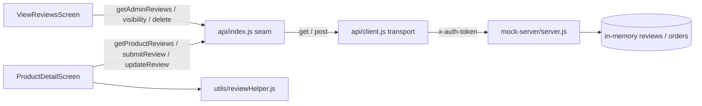
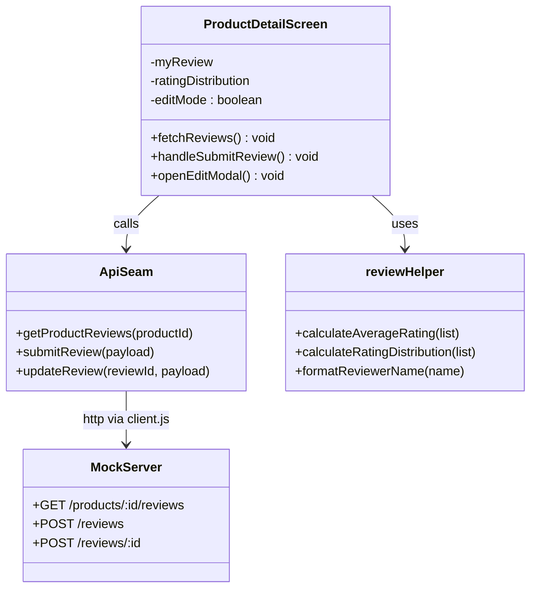
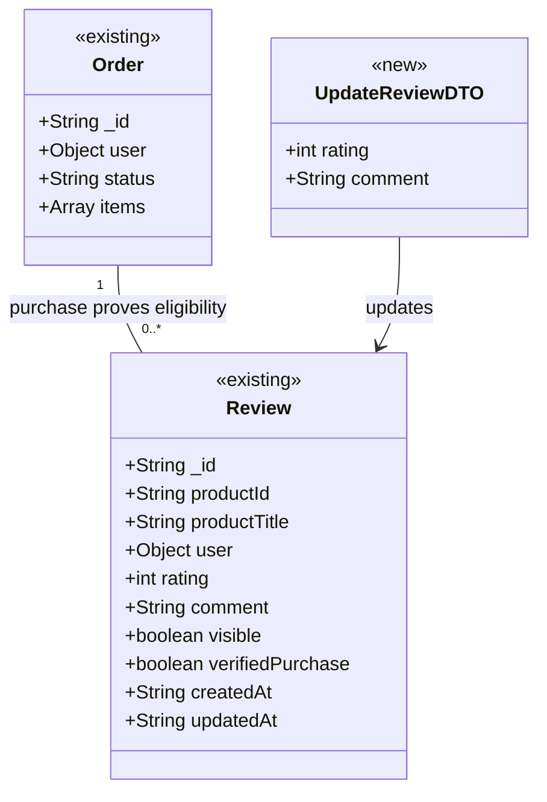

# Design: Complete Verified Purchaser Ratings and Reviews (Agentic-SDLC-test/ecommerce-react-native-example#1)

> Linked Jira Epic: [Agentic-SDLC-test/ecommerce-react-native-example#1](https://github.com/Agentic-SDLC-test/ecommerce-react-native-example/issues/1)
> Business spec: v1 (submitted 2026-09-09T19:19:14Z by c1a22397-e146-4fff-b0fd-606b23112883)
> Architect: ALORA Design Agent

## Architecture overview

### Problem essence and value

Complete and harden the app's existing verified-purchaser review capability so shoppers can trust purchase-backed feedback. Verified-purchaser gating, one-review-per-product enforcement, average/count display, recent-reviews rendering, and admin hide/show/delete moderation **already exist** end-to-end. This design closes the three remaining, purely additive gaps from Epic `Agentic-SDLC-test/ecommerce-react-native-example#1`: (1) let a customer **edit** the single review they already left, (2) surface a **rating distribution** across the five star levels on the product detail page, and (3) show a **"Verified Purchase"** indicator on each displayed review. Implicit requirement surfaced: the distribution and average must be computed from the same visible-only review set so moderation and edits never leave a stale or misleading summary.

### Scope and boundaries

- **In scope**: review editing (client seam operation + one new mock-server endpoint + product-detail edit UI); rating-distribution computation (helper + backend field + UI bars); Verified Purchase badge (server-stamped flag + UI badge); confirmation that eligibility (AC-1) and moderation (AC-5) already satisfy the Epic.
- **Out of scope**: photo/video reviews; review helpfulness voting; replies to reviews (all Epic-declared out of scope). Shopper-facing sort/filter controls beyond most-recent-first (see Q-3). Approval-queue moderation (see Q-1).
- **Conservative-reuse stance**: The API seam (`api/index.js` named operations over the `api/client.js` `get`/`post` transport), the mock-server route style, the `utils/reviewHelper.js` pure-function module, the `ProductDetailScreen` review modal, and the admin `ViewReviewsScreen` moderation flow are all **reused unchanged where they already satisfy an AC and extended in place where a gap exists**. No component is replaced. Editing is added as a dedicated update path rather than overloading the create endpoint, because create enforces the one-review-per-product invariant by rejecting a second submission — editing is semantically an update to the existing row.

### High-level architecture

The app follows a **screen → API-seam → HTTP-transport** layering with a mirrored mock-server backend. Screens (`screens/user`, `screens/admin`) never build fetch calls directly; they call named operations in `api/index.js`, which delegate to `get`/`post` in `api/client.js` (auth-token injection, JSON parsing, centralized JWT-expiry redirect). Pure presentation/computation helpers live in `utils/reviewHelper.js`. The same flat response contract (`{ success, message, data, ... }`) is served by both the production Node backend and `mock-server/server.js`, so every change lands on both surfaces to preserve backend parity.

This design adds exactly one new seam operation (`updateReview`), one new mock-server endpoint (`POST /reviews/:id`), two new response fields on the existing product-reviews read endpoint (`ratingDistribution`, `myReview`), one new pure helper (`calculateRatingDistribution`), a server-stamped `verifiedPurchase` flag, and additive UI in `ProductDetailScreen`.



### Key design decisions

- **Editing as a dedicated update endpoint (`POST /reviews/:id`), not create-upsert** — Trade-offs: overloading `POST /reviews` to upsert would collapse two flows but muddy the existing "already reviewed" rejection that guards the one-per-product invariant and complicate its error semantics. A distinct update path keeps create's rejection intact, re-validates eligibility + ownership independently, and maps cleanly to a new named operation. Rationale: matches the seam's one-operation-per-intent style already visible in `api/index.js`.
- **Return the caller's own review (`myReview`) from the read endpoint** — Trade-off: a small addition to the GET payload vs. a second round-trip. Rationale: the edit modal must prefill the user's current rating/comment, and a hidden-by-admin own-review is excluded from the public `reviews` array, so the client cannot reliably derive it from the visible list. Server returns it explicitly.
- **Server-stamped `verifiedPurchase` flag rather than an unconditional UI badge** — Trade-off: one boolean per review vs. hardcoding the badge in the UI. Rationale: the business spec's own risk register warns a blanket UI label would mislead if eligibility were ever loosened; stamping the flag at creation/edit time (derived from the eligibility check the server already runs) keeps the badge honest and tied to the real guarantee.
- **Compute distribution from the visible-only set, server-side and client-side from the same list** — Rationale: guarantees average, count, and distribution stay mutually consistent and exclude hidden/removed reviews.

### Alternatives considered

- **Upsert on `POST /reviews`** — rejected: blurs the create/edit boundary and weakens the one-per-product rejection path.
- **Deriving `myReview` client-side from `reviews[]`** — rejected: fails when the user's own review is hidden by an admin (filtered out of the visible list), leaving edit unable to prefill.
- **Redux-backed review state** — rejected: the project deliberately keeps Redux minimal (cart only) and flows review data through component state + API; introducing a review slice would contradict an established convention for no benefit.

## Affected repositories

- **Agentic-SDLC-test/ecommerce-react-native-example** (branch `main`, type `primary`) — extend the API seam (`api/index.js`), the review helper (`utils/reviewHelper.js`), the user product-detail screen (`screens/user/ProductDetailScreen.js`), the mock-server (`mock-server/server.js`) and unit tests (`__tests__/reviews.test.js`); confirm the admin moderation screen (`screens/admin/ViewReviewsScreen.js`) unchanged.

> All changes are confined to the single supplied `repository_targets[]` entry. No change falls outside it.

## Component-level design

### Layered architecture and dependency map



### Extension points

- `updateReview(reviewId, payload)` and `POST /reviews/:id` are shaped so a future "delete-own-review" or field additions (e.g. title) extend the same payload without new operations.
- `calculateRatingDistribution` returns a 1–5 keyed map, leaving room for a future sort/filter feature (Q-3) to consume it without recomputation.
- Otherwise closed for now — no speculative abstraction added.

### Conventions in use

Pulled directly from the codebase; the implementation MUST conform to these and introduce none new:

- **Module style**: ES6 modules; React functional components with hooks (`useState`/`useEffect`). Pure helpers are stateless named exports in `utils/`.
- **API access**: screens call named operations from `../../api`; never construct fetch directly. New operations are one-line named exports in `api/index.js` delegating to `get`/`post`.
- **Backend responses**: flat `{ success, message, data, ... }`; the read endpoint also returns top-level `reviews`, `averageRating`, `totalCount`, `isEligible`, `hasReviewed`. New fields are added top-level alongside these.
- **Error/validation handling**: screens branch on `result.success`, set an `error`/`submitError` string and an `alertType` (`"success"`/`"error"`), and render `CustomAlert`. Backend validates and returns `res.status(4xx).json({ success:false, message })`.
- **Auth**: `authMiddleware`/`adminMiddleware` in the mock-server validate `x-auth-token`; the client injects the token automatically.
- **UI**: React Native `StyleSheet.create`; `Ionicons` stars; every interactive/visible element carries a `testID` following the screen's kebab prefix (e.g. `product-detail-...`).
- **Comment limit**: 500 characters, enforced both in the modal (`maxLength`/char counter) and server-side.

### ProductDetailScreen (modified — `screens/user/ProductDetailScreen.js`)

- **Responsibility**: Render product detail, ratings summary (now with distribution), reviews list (now with Verified Purchase badge), and the write/edit review modal.
- **Collaborators**: `api` seam (`getProductReviews`, `submitReview`, `updateReview`), `reviewHelper` (`formatReviewerName`, `calculateRatingDistribution`), `CustomAlert`, `CustomButton`.
- **State added**: `myReview` (object|null), `ratingDistribution` (object `{1..5:number}`), `editMode` (boolean).
- **Methods**:
  - `fetchReviews()` — on success, additionally `setMyReview(result.myReview ?? null)` and `setRatingDistribution(result.ratingDistribution ?? {1:0,2:0,3:0,4:0,5:0})`.
  - `openEditModal()` — set `editMode=true`, prefill `userRating=myReview.rating`, `userComment=myReview.comment`, open modal.
  - `handleSubmitReview()` — validate `userRating` in 1..5; if `editMode` call `api.updateReview(myReview._id, { rating, comment })`, else `api.submitReview({ productId, rating, comment })`; on success close modal, reset state, `fetchReviews()`.
- **UI changes**: button reads "Write a Review" when `isEligible && !hasReviewed`, "Edit Your Review" when `isEligible && hasReviewed` (opens prefilled modal); a distribution block (five rows: star level, proportional bar, count) rendered from `ratingDistribution`/`totalCount`; a "Verified Purchase" badge rendered on each review card where `rev.verifiedPurchase`.
- **Concurrency boundary**: single-flight guarded by `submittingReview`/`reviewsLoading` flags (existing pattern).

### reviewHelper (modified — `utils/reviewHelper.js`)

- **Responsibility**: pure review computations/formatting.
- **Methods**:
  - `calculateRatingDistribution(reviewsList): {1:number,2:number,3:number,4:number,5:number}` — returns zeroed map for null/empty; increments the bucket for each `r.rating` clamped to integer 1..5; ignores out-of-range ratings defensively.
- **Annotations**: none (plain named export).

### API seam (modified — `api/index.js`)

- **Responsibility**: named backend operations.
- **Method added**: `updateReview(reviewId, payload) => post(\`/reviews/${q(reviewId)}\`, payload)` where `payload = { rating, comment }`.

### Mock-server (modified — `mock-server/server.js`)

- **`GET /products/:id/reviews`**: add `ratingDistribution` (counts over the visible set, keyed 1..5) and `myReview` (the token-holder's own review object regardless of visibility, or `null`) to the response.
- **`POST /reviews`**: stamp `verifiedPurchase: true` on the created review (the eligibility check already proved it). Seed reviews get `verifiedPurchase: true`.
- **`POST /reviews/:id` (new, `authMiddleware`)**: locate review by `_id`; 404 if absent; 403 if `review.user._id !== req.user._id` (ownership); re-run the delivered-order eligibility check for `review.productId` and reject with 400 if no longer eligible; validate rating integer 1..5 and comment ≤ 500; update `rating`, `comment`, set `updatedAt`; keep `verifiedPurchase: true`; return `{ success:true, message:"Review updated successfully", data: review }`.
- **Transaction/concurrency boundary**: in-memory array mutation; single-process mock, no locking needed.

## UI/UX design notes

Three additive surfaces on the product detail page, reusing existing styling tokens (`colors`, Ionicons stars, `StyleSheet`):

- **Rating distribution**: below the existing average/count line, render five rows (5★→1★), each a label, a horizontal proportional bar (width = `count/totalCount`), and the count. Empty state: when `totalCount === 0` the block is hidden and the existing "No reviews yet" text stands. `testID`s `product-detail-distribution-row-<star>`.
- **Verified Purchase badge**: a small pill (checkmark Ionicon + "Verified Purchase") inside each review card header where `rev.verifiedPurchase` is truthy. `testID` `product-detail-review-verified-<id>`.
- **Edit affordance**: the existing single action button toggles label/behavior between write and edit based on `hasReviewed`; the modal is reused, prefilled in edit mode, title "Edit Your Review". Cancel resets `editMode`. `testID` `product-detail-edit-review-btn`.

Admin `ViewReviewsScreen` is unchanged — it already lists all reviews with hide/show/delete controls satisfying AC-5. Interaction patterns (modal, char counter, `CustomAlert`) reuse the current conventions.

## API schemas and contracts

All endpoints use the flat `{ success, message, ... }` contract, authenticated with the `x-auth-token` header injected by `api/client.js`. Reads are public; writes require a valid customer token; admin endpoints require an ADMIN token.

```http
GET /products/{id}/reviews
Auth: optional x-auth-token (enables isEligible/hasReviewed/myReview)
200 OK -> {
  "success": true,
  "reviews": [ { "_id": "string", "productId": "string", "user": { "_id": "string", "name": "string" }, "rating": 1, "comment": "string", "visible": true, "verifiedPurchase": true, "createdAt": "ISO-8601", "updatedAt": "ISO-8601" } ],
  "averageRating": 4.3,
  "totalCount": 12,
  "ratingDistribution": { "1": 0, "2": 1, "3": 2, "4": 4, "5": 5 },
  "isEligible": true,
  "hasReviewed": true,
  "myReview": { "_id": "string", "rating": 5, "comment": "string", "visible": true, "verifiedPurchase": true, "createdAt": "ISO-8601", "updatedAt": "ISO-8601" }
}
404 Not Found -> { "success": false, "message": "Product not found" }
```

```http
POST /reviews
Auth: x-auth-token (required)
Body -> { "productId": "string", "rating": 1..5 (int), "comment": "string (<=500, optional)" }
200 OK -> { "success": true, "message": "Review submitted successfully", "data": { ...review, "verifiedPurchase": true } }
400 -> { "success": false, "message": "You are not eligible to review this product" | "You have already reviewed this product" | "Rating must be an integer between 1 and 5" | "Comment must be at most 500 characters" }
404 -> { "success": false, "message": "Product not found" }
```

```http
POST /reviews/{id}   (NEW — edit own review)
Auth: x-auth-token (required; must be the review author)
Body -> { "rating": 1..5 (int), "comment": "string (<=500, optional)" }
200 OK -> { "success": true, "message": "Review updated successfully", "data": { ...review, "updatedAt": "ISO-8601" } }
400 -> { "success": false, "message": "Rating must be an integer between 1 and 5" | "Comment must be at most 500 characters" | "You are not eligible to review this product" }
403 -> { "success": false, "message": "You can only edit your own review" }
404 -> { "success": false, "message": "Review not found" }
```

Existing admin endpoints (`GET /admin/reviews`, `POST /admin/reviews/{id}/visibility`, `POST /admin/reviews/{id}/delete`) are unchanged and already satisfy AC-5. No event/message contracts apply — this is a synchronous request/response app.

## Integration patterns

- **Inbound**: React Native screens → `api/index.js` named operations → `api/client.js` `get`/`post` → mock-server (or production backend). New `updateReview` follows the identical inbound path; no new transport code.
- **Outbound**: none new — the app makes no third-party or message-bus calls for reviews. Eligibility reads existing in-memory `orders` (delivered status) inside the mock-server.
- **Idempotency / retry**: `POST /reviews/{id}` is naturally idempotent (repeated edits with the same body converge to the same state); no dedupe key needed. `POST /reviews` remains guarded by the one-per-product `hasReviewed` check, so an accidental double-submit returns a 400 rather than creating a duplicate. No automatic client retries are added (consistent with current behavior).

## Data model changes

### Entity relationships



### Schema changes

- **New tables**: none.
- **Review record fields**: add `verifiedPurchase: boolean` (default `true`, set at create/edit from the eligibility guarantee) and `updatedAt: ISO-8601 string` (set on edit). In the mock-server these are new keys on the in-memory `reviews` objects and on the two seed entries. For a production SQL/NoSQL backend the equivalents are a `verified_purchase BOOLEAN NOT NULL DEFAULT true` column and an `updated_at TIMESTAMP` column, plus the already-implied unique `(user_id, product_id)` constraint enforcing one review per product.
- **ORM entity changes**: extend the Review entity with the two fields above (mirrors the diagram). No relationship changes.

### Backward-compatibility plan

Both new fields are additive and default-safe. Existing reviews without `verifiedPurchase` are treated as verified (the UI badge reads `rev.verifiedPurchase` truthily; seeds are updated to `true`), and `updatedAt` is optional (absent until first edit; the UI falls back to `createdAt` for date display). No destructive migration; no dual-write window required. Older clients ignore the new response fields (`ratingDistribution`, `myReview`) harmlessly.

## Security and compliance considerations

- **Auth**: `GET /products/:id/reviews` stays public (token optional, only enriches eligibility/`myReview`). `POST /reviews` and the new `POST /reviews/:id` require a valid customer token via `authMiddleware`. Admin endpoints keep `adminMiddleware`.
- **Authorization**: edit enforces **ownership** (`review.user._id === req.user._id`) and **re-validates delivered-purchase eligibility** on every edit, so a user cannot edit another user's review or retain a review after losing eligibility.
- **Secrets**: none introduced.
- **PII / data classification**: reviewer display name is already stored and shown truncated (`formatReviewerName`); no new PII collected. The Verified Purchase flag is derived, not new personal data.
- **Audit log entries**: mock-server retains its `console.log` on create; add a log line on edit (`Review updated for product: <id> by <userId>`) and keep admin visibility/delete logs. A production backend should record edit actor + timestamp.
- **Regulatory constraints**: none specific; comment length cap (500) and integer rating validation guard against oversized/malformed input.

## Observability requirements

- **Structured logs**: on edit, emit `Review updated for product: <productId> by user <userId>`; retain existing create log (`Review created for product: <productId>`) and admin moderation logs (visibility toggle, delete). Client logs API errors via existing `console.log("error ...", err)` calls.
- **Metrics**: none in the mock-server (no metrics stack present). For the production backend, recommended counters: `reviews_created_total`, `reviews_updated_total`, `reviews_moderated_total{action=hide|show|delete}`, and a histogram `review_read_latency_ms` on `GET /products/:id/reviews`.
- **Traces**: not applicable — no distributed tracing in this app; note as a production-backend recommendation only.
- **Dashboards / alerts**: none added for the mock-server. Production SLO suggestion: alert if review-read p95 latency exceeds 300 ms or if `reviews_updated_total` error rate exceeds 2% over 15 minutes.

## Implementation plan

> This section is the prompt for Code Generation. Order is dependency-first: backend contract, then helper, then seam, then UI, then tests.

### Phase 1 — Backend contract (mock-server + production parity)

1. **`mock-server/server.js` — read endpoint** — in `GET /products/:id/reviews`, after computing `productReviews`/`averageRating`/`totalCount`, build `ratingDistribution = {1:0,2:0,3:0,4:0,5:0}` over the visible set and, when a valid token is present, set `myReview` to the caller's own review (search full `reviews`, not just visible). Add both to the JSON response. Verify by hitting the endpoint with and without a token and asserting the new fields.
2. **`mock-server/server.js` — create + seed** — set `verifiedPurchase: true` on the object built in `POST /reviews`; add `verifiedPurchase: true` to the two seed reviews (`rev001`, `rev002`). Verify a freshly created review carries the flag.
3. **`mock-server/server.js` — new edit endpoint** — add `app.post("/reviews/:id", authMiddleware, ...)`: find review by `_id` (404 if none); enforce `review.user._id === req.user._id` (403 "You can only edit your own review"); re-check delivered-order eligibility for `review.productId` (400 if not eligible); validate `rating` integer 1..5 and `comment` ≤ 500; assign `rating`, `comment`, `updatedAt = new Date().toISOString()`; log the edit; return `{ success:true, message:"Review updated successfully", data: review }`. Verify each branch by curl.

### Phase 2 — Helper

1. **`utils/reviewHelper.js`** — add and export `calculateRatingDistribution(reviewsList)` returning a 1..5 keyed count map (zeroed for null/empty, defensive clamp to integer buckets). Verify with the unit tests in Phase 5.

### Phase 3 — API seam

1. **`api/index.js`** — under `// ---- Reviews ----`, add `export const updateReview = (reviewId, payload) => post(\`/reviews/${q(reviewId)}\`, payload);`. Verify it composes the correct path.

### Phase 4 — UI wiring

1. **`screens/user/ProductDetailScreen.js` — state + fetch** — add `myReview`, `ratingDistribution`, `editMode` state; in `fetchReviews` success set `myReview` and `ratingDistribution` from the response (with safe defaults). 
2. **Edit flow** — replace the write-only button block: show "Write a Review" when `isEligible && !hasReviewed`; show "Edit Your Review" (`testID=product-detail-edit-review-btn`) when `isEligible && hasReviewed`, which prefills `userRating`/`userComment` from `myReview` and sets `editMode=true`. In `handleSubmitReview`, branch on `editMode` to call `api.updateReview(myReview._id, {...})` vs `api.submitReview({...})`; reset `editMode` on cancel/success.
3. **Distribution UI** — under the ratings summary, when `totalCount > 0`, render five rows from `ratingDistribution` (proportional bar + count, `testID=product-detail-distribution-row-<star>`).
4. **Verified Purchase badge** — in each review card, render a pill when `rev.verifiedPurchase` (`testID=product-detail-review-verified-<id>`). Add matching `StyleSheet` entries. Verify visually via `npm run web`/Expo.

### Phase 5 — Tests and hardening

1. **`__tests__/reviews.test.js`** — add a `calculateRatingDistribution` describe block (empty/null → all-zero map; mixed ratings → correct buckets; ignores out-of-range). Run `npm test`.
2. Run `npm run lint` and `npm test`; smoke-test the edit + distribution + badge flow against the mock-server.

## Test strategy

### Test layers

- **Unit tests** (`__tests__/reviews.test.js`, `jest-expo`): existing `formatReviewerName`, `calculateAverageRating`, `truncateReviewComment` retained; add `calculateRatingDistribution` covering happy path, empty/null, and out-of-range ratings. These are the runnable automated tests (Jest config ignores `mock-server/`).
- **Integration tests**: exercise the mock-server endpoints manually/via a lightweight script — `POST /reviews/:id` ownership (403), non-eligibility (400), validation (400), success (200); `GET /products/:id/reviews` returning `ratingDistribution` + `myReview`. (Documented as manual because the project's Jest config excludes the mock-server.)
- **Smoke tests**: after starting the mock-server, load a product detail page in Expo web and confirm distribution renders, badge shows, and edit round-trips.
- **E2E (where applicable)**: the `android-e2e-testing` capability (ADB-driven) can validate the edit modal prefill and distribution bars on an Android emulator for the full customer flow.

### Acceptance Criteria coverage

| AC# | Description | Covered by | Notes |
| --- | ----------- | ---------- | ----- |
| 1 | Only verified purchasers may submit a review | Existing `POST /reviews` eligibility check (confirmed); edit re-checks eligibility | Already satisfied; confirmed unchanged |
| 2 | One review per product, editable | `POST /reviews` one-per-product guard (existing) + new `POST /reviews/:id` + `updateReview` + edit UI | Edit is the new capability |
| 3 | Average, count, distribution, recent reviews on product page | Existing average/count/recent + new `calculateRatingDistribution`, `ratingDistribution` field, distribution UI | Distribution is the new capability; unit-tested |
| 4 | Verified Purchase indicator | Server `verifiedPurchase` flag + badge UI | New indicator, tied to eligibility |
| 5 | Admin hide/remove/toggle visibility | Existing `ViewReviewsScreen` + admin endpoints | Confirmed complete; no change |

### Performance targets and quality bars

- **Latency**: `GET /products/:id/reviews` p95 < 300 ms (distribution is an O(n) pass over an already-filtered small list).
- **Data validation invariants** (each with a test/manual check): rating is an integer in 1..5; comment ≤ 500 chars; a user has at most one review per product; edit is author-only; hidden reviews are excluded from average, count, and distribution.
- **Resource limits**: comment payload ≤ 500 chars; no unbounded lists (reviews rendered are sliced to 5 recent in the UI).

### Flake risks and fixtures

- **Time-sensitive**: `createdAt`/`updatedAt` use real timestamps; assert on presence/ordering, not exact values. Sort-by-recency depends on distinct `createdAt` — keep seed timestamps distinct.
- **Shared state**: the mock-server holds reviews in memory; integration checks must account for ordering/accumulation across calls (restart to reset).

## Rollout and rollback considerations

- **Feature flag**: not warranted for the mock-server (single dev backend, in-memory). For a production backend, gate the edit endpoint behind `reviews_edit_enabled` (default off until verified) — recorded here as a recommendation, not implemented in this repo.
- **Canary**: n/a for the app binary; production backend can ramp the edit endpoint 10%→50%→100% watching edit error rate.
- **Backfill / migration ordering**: deploy backend fields (`verifiedPurchase`, `updatedAt`) and the read-endpoint additions **before** shipping the client UI, so the app degrades gracefully (safe defaults) if it runs against an older backend. Seed/backfill existing reviews with `verifiedPurchase = true`.
- **Rollback plan**: revert the client UI (badge/distribution/edit button) independently of the backend; the new endpoint and fields are additive and safe to leave in place, or drop the `verifiedPurchase`/`updatedAt` columns and remove the edit route to fully revert.
- **Monitoring during rollout**: watch review-read latency, edit endpoint 4xx/5xx rate, and (production) the moderation counters for anomalies after enabling edits.

## Validation summary

- **Jira Epic**: `Agentic-SDLC-test/ecommerce-react-native-example#1`
- **Acceptance Criteria coverage**:
  - AC-1 (verified purchasers only) → satisfied by the existing `POST /reviews` eligibility check, confirmed and preserved; edit re-validates eligibility (Component-level design, API schemas).
  - AC-2 (one editable review) → one-per-product enforced today; **edit added** via `POST /reviews/:id`, `updateReview`, and the product-detail edit UI (Phases 1, 3, 4).
  - AC-3 (average, count, distribution, recent) → average/count/recent exist; **distribution added** via `calculateRatingDistribution`, the `ratingDistribution` field, and distribution UI (Phases 1, 2, 4; unit-tested Phase 5).
  - AC-4 (Verified Purchase indicator) → **added** as a server-stamped `verifiedPurchase` flag plus a per-review badge tied to the eligibility guarantee (Phases 1, 4).
  - AC-5 (admin moderation) → satisfied by the existing `ViewReviewsScreen` and admin endpoints; confirmed complete, no change.
- **Open questions**: `Q-1` (moderation model), `Q-2` (written comment required vs optional), `Q-3` (shopper sort/filter) — all non-blocking; each is designed around with a working assumption matching current behavior (reactive moderation, comment optional, most-recent-first).
- **Known risks accepted**: distribution/average computed from visible-only reviews to avoid stale summaries after edits/moderation; Verified Purchase badge kept server-derived rather than unconditional to stay honest if eligibility ever changes; backend parity maintained by landing the edit capability on the mock-server as part of this change.