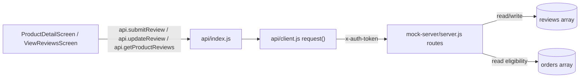
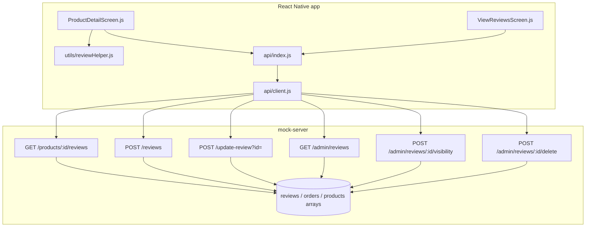
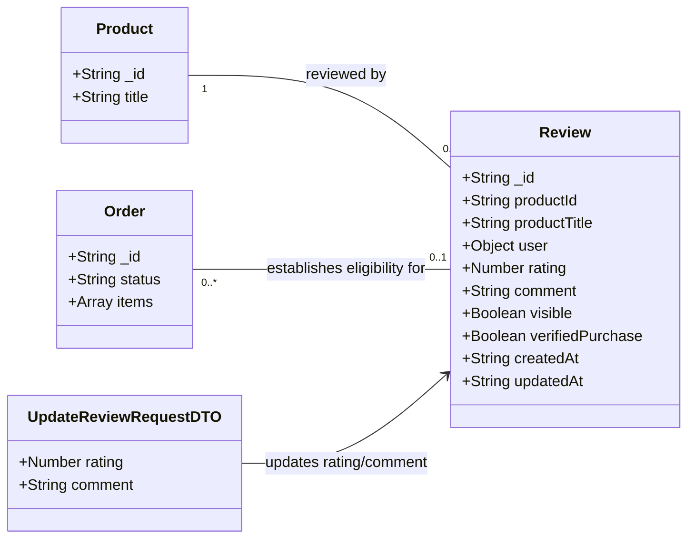

# Design: Verified Purchaser Ratings and Reviews (Agentic-SDLC-test/ecommerce-react-native-example#1)

> Linked Jira Epic: Agentic-SDLC-test/ecommerce-react-native-example#1 ("Test epic")
> Business spec: Ideation analysis v1
> Stage: Design

## Architecture overview

### Problem essence and value
Let a customer who has a delivered order for a product write one review and later revise it, mark that review as a verified purchase, and let shoppers see a fuller rating picture (average, total count, a 1-5 star distribution, and recent reviews) on the product detail page. This closes two functional gaps against the current EasyBuy review system - review editing (BR-3) and a Verified Purchase indicator (BR-4) - and one presentation gap - rating distribution (BR-5) - while leaving the already-satisfied eligibility gating (BR-1), one-review-per-product limit (BR-2), recent-reviews display (BR-6), and admin moderation (BR-7) untouched.

An implicit requirement surfaced by the Ideation assumptions: editing a review must not let a customer silently undo a prior admin moderation decision. This design keeps `visible` untouched across an edit, so a review an admin hid stays hidden until an admin explicitly re-shows it, even after the owner edits it.

### Scope and boundaries
- In scope: extending the `Review` shape with `verifiedPurchase` and `updatedAt`; a new review-edit API path; a rating distribution computation in the reviews-read response; UI for editing a review and for displaying the Verified Purchase badge and the distribution bars.
- Out of scope: photo/video attachments, review-helpfulness voting, threaded replies (epic-level non-goals); sort/filter controls on the review list (Ideation open question, deferred, can be added later without reshaping this design); any change to the eligibility rule itself (already correct and reused as-is).
- Conservative-reuse stance: no new layers, services, or frameworks are introduced. The existing Express route-handler style in `mock-server/server.js`, the flat `{ success, data/reviews, message }` response contract in `api/client.js`, and the existing `ProductDetailScreen` / `ViewReviewsScreen` component structure are all reused unchanged; only the `Review` object gains two fields and one new route, symmetric to the existing `update-product` / `update-category` naming pattern.

### High-level architecture
EasyBuy's review feature is a thin, three-tier flow: a React Native screen calls a named operation in `api/index.js`, which goes through the shared `request()` transport in `api/client.js` (auth header injection, JSON parsing, jwt-expiry handling), which hits an Express route in `mock-server/server.js` that reads and writes the module-level `reviews` and `orders` in-memory arrays. There is no service or repository layer to insert into - the route handlers are the service layer and the in-memory arrays are the repository - and this design keeps that shape rather than introducing one. The new edit capability adds one more named client operation and one more Express route, following the same shape as every existing mutation in the file.



### Key design decisions
- Edit as a new sub-resource route, not a PUT - `POST /update-review?id=` mirrors the existing `POST /update-product?id=` and `POST /update-category?id=` pattern instead of a REST-purist `PUT /reviews/:id`, keeping the endpoint style consistent with every other mutation in `mock-server/server.js`.
- `verifiedPurchase` is stored on the Review row at creation time rather than computed on every read - matches how `visible` and `createdAt` are already denormalized onto the Review; avoids an Orders join on the hot `GET /products/:id/reviews` path. See Q-1 for the trade-off this accepts.
- The rating distribution is computed inline inside the existing `GET /products/:id/reviews` handler - that handler already reduces the same `productReviews` array to get `averageRating` and `totalCount`; the distribution is one more `reduce` over the same collection, not a new query or a new endpoint.
- Edit never touches `visible` - an edited review keeps whatever moderation state it already had, per the Ideation assumption that only an admin can re-show a hidden review; this prevents edit from being usable to bypass moderation.

### Alternatives considered
- A separate `PUT /reviews/:id` was rejected: every other mutation in `mock-server/server.js` is `POST`, several as `POST /<resource>/:id/<verb>` or `POST /update-<resource>?id=`; a lone `PUT` would be the only one in the file and would break the naming symmetry the rest of the design leans on.
- Recomputing `verifiedPurchase` live from `orders` on every read was considered as the default and rejected in favor of the snapshot approach (see Q-1): live recomputation correctly reflects order cancellations after the fact but adds a per-review orders scan to the read path for a benefit the business spec explicitly flags as unresolved, not required.

## Affected repositories
- Agentic-SDLC-test/ecommerce-react-native-example (branch `main`, target type `primary`) - extends `mock-server/server.js` (Review shape plus two route handlers), `api/index.js` (one new client operation), `utils/reviewHelper.js` (one new pure helper), and `screens/user/ProductDetailScreen.js` plus `screens/admin/ViewReviewsScreen.js` (edit UI, distribution bars, Verified Purchase badge). No other repository is in scope; `repository_targets[]` names only this one.

## Component-level design

### Layered architecture and dependency map


### Extension points
- The moderation model stays a single `visible: boolean` flag. If the Architect later picks the pre-publish-approval alternative in Q-2, it slots in as an additional `status` field on Review without renaming or removing `visible`.
- `ratingDistribution` is computed from the same `productReviews` array `averageRating` already uses, so a future "filter by star" control (Ideation's deferred sort/filter question) only needs a query-param branch over that same array, not a new code path.

### Conventions in use
- Annotations / decorators: none. The project has no decorator or annotation framework; routes are registered directly via `app.get(...)` / `app.post(...)`.
- Dependency injection: none. Route handlers close over the module-level `products`, `categories`, `orders`, and `reviews` arrays declared at the top of `mock-server/server.js`; the new handler follows the same closure pattern.
- Exception handling: no custom exception hierarchy. Handlers validate inline and return `res.status(<code>).json({ success: false, message: "..." })`; the new `/update-review` handler follows this exact shape (400 for validation, 403 for non-owner, 404 for missing review).
- Input validation: inline per-handler checks (`parseInt` plus a range check for `rating`, a length check for `comment`); the new handler reuses the identical rating/comment validation already written in `POST /reviews`.
- Logging: bare `console.log(message, ...args)` at the point of mutation, e.g. `console.log('Review created for product:', productId)`; the new handler adds one matching line.
- Documentation: a `// --- Section ---` banner above each route group and a one-line `//` comment above each `app.METHOD` call; the new route keeps both.

### mock-server/server.js - reviews routes
- Responsibility: own the `reviews` in-memory collection and every HTTP entry point that reads or mutates it.
- Collaborators: `orders` (eligibility check), `products` (existence check and title snapshot), `users` (via `authMiddleware` / `adminMiddleware`).
- Methods:
  - `GET /products/:id/reviews` (extended) - input validation unchanged (404 if `id` does not match a product). Business logic: filter `reviews` to `productId === id && visible === true` (unchanged); compute `averageRating` / `totalCount` (unchanged); new - compute `ratingDistribution = { "1": n, "2": n, "3": n, "4": n, "5": n }` via one `reduce` over the same filtered array; new - when the `x-auth-token` header resolves to a known user, compute `myReview = reviews.find(r => r.productId === id && r.user._id === user._id)` without the `visible === true` filter, so the owner can always see and edit their own review even if an admin hid it. Return value: existing fields (`reviews`, `averageRating`, `totalCount`, `isEligible`, `hasReviewed`) plus `ratingDistribution` and `myReview` (object or `null`).
  - `POST /reviews` (extended) - input validation unchanged (`productId` and `rating` required, rating integer 1-5, comment at most 500 characters, eligibility check, one-review-per-product check). Business logic: new - set `verifiedPurchase: true` on the created row (reaching this line already required `isEligible` to be true, so every review created here is by definition from a verified purchase at submission time) and `updatedAt` equal to the same ISO timestamp as `createdAt`. Exception handling unchanged. Return value: the created review, now carrying `verifiedPurchase` and `updatedAt`.
  - `POST /update-review` (new) - input validation: `id` query parameter required; `rating` integer 1-5 when provided; `comment` at most 500 characters when provided, identical rules to `POST /reviews`. Business logic: `authMiddleware` resolves `req.user`; look up the review by `id`; if `review.user._id !== req.user._id` return 403 with message "You can only edit your own review"; otherwise set `review.rating`, `review.comment`, and `review.updatedAt = new Date().toISOString()`. `review.visible` and `review.verifiedPurchase` are left untouched. Exception handling: 404 "Review not found" when `id` does not match any review; 403 for a non-owner; 400 for a failed rating/comment validation, mirroring `POST /reviews`'s response shape. Return value: `{ success: true, message: "Review updated successfully", data: <updated review> }`.
- Transaction / concurrency boundary: single-process, in-memory array mutation, matching every other write in this file; no transaction concept exists or is introduced.

### api/index.js - reviews operations
- Responsibility: the named-operation seam screens call instead of building `fetch` calls directly.
- Collaborators: `get` / `post` from `api/client.js`.
- Methods:
  - `export const updateReview = (reviewId, payload) => post(\`/update-review?id=${q(reviewId)}\`, payload);` - added directly below the existing `export const submitReview = ...` line, matching the `q()`-encoded query-param style already used by `updateProduct` and `updateCategory`.

### utils/reviewHelper.js - getRatingDistributionPercentage
- Responsibility: a pure, unit-testable conversion from a star-level count to a bar-width percentage for the client-side distribution chart. The counts themselves come from the server's `ratingDistribution`, so this helper does no aggregation, only the same kind of percentage math the existing helpers already do for other review presentation concerns.
- Collaborators: consumed by `ProductDetailScreen.js`; unit-tested in `__tests__/reviews.test.js` alongside `calculateAverageRating` and `truncateReviewComment`.
- Methods:
  - `getRatingDistributionPercentage(count, total): number` - input validation: returns `0` when `total` is `0`, `null`, or `undefined`, mirroring the empty-list branch already in `calculateAverageRating`. Business logic: `Math.round((count / total) * 100)`. Return value: an integer `0` to `100` used directly as a percentage bar width.

### screens/user/ProductDetailScreen.js
- Responsibility: render the product's rating summary, distribution, and recent reviews; let an eligible customer write or edit their own review.
- Collaborators: `api.getProductReviews`, `api.submitReview`, `api.updateReview`, and `formatReviewerName` / `getRatingDistributionPercentage` from `utils/reviewHelper.js`.
- New or changed state: `myReview` (object or `null`, from the extended `GET /products/:id/reviews` response), `ratingDistribution` (`{1..5: count}`), `isEditMode` (boolean, drives the review modal's title and submit target).
- Methods:
  - `fetchReviews()` (extended) - also sets `myReview` and `ratingDistribution` from the response.
  - `openReviewModal()` (new) - if `myReview` exists, sets `isEditMode = true` and pre-fills `userRating` / `userComment` from it; otherwise opens in create mode exactly as today.
  - `handleSubmitReview()` (extended) - branches on `isEditMode`: calls `api.updateReview(myReview._id, { rating: userRating, comment: userComment })` when editing, `api.submitReview({ productId, rating, comment })` otherwise (unchanged path); both branches call `fetchReviews()` on success to refresh `averageRating`, `ratingDistribution`, and `myReview`.
  - Render changes: show "Write a Review" when `isEligible && !hasReviewed`; show "Edit Your Review" when `hasReviewed && myReview`; render a five-row `ratingDistribution` bar chart (star label, bar sized by `getRatingDistributionPercentage`, raw count) directly under the existing rating summary and before the write/edit button; render a small "Verified Purchase" badge on every review card, including the reviewer's own, wherever `rev.verifiedPurchase === true`.
- Annotations / decorators: none, functional component plus hooks, matching every other screen in the project.

### screens/admin/ViewReviewsScreen.js
- Responsibility: let an admin search, hide/show, and delete any review.
- Collaborators: `api.getAdminReviews`, `api.updateReviewVisibility`, `api.deleteReview` (all unchanged).
- Change: render the same "Verified Purchase" badge used on `ProductDetailScreen` next to each review card's star display, using the `verifiedPurchase` field the admin-reviews payload already carries once `POST /reviews` stamps it.

## UI/UX design notes
- Rating distribution: five stacked rows (5 stars down to 1 star), each showing a star-count label, a horizontal bar whose width is `getRatingDistributionPercentage(ratingDistribution[n], totalCount)`, and the raw count - placed directly beneath the existing stars-and-count summary on `ProductDetailScreen`, before the write/edit review button. When `totalCount === 0`, no extra bars render beyond the existing "No reviews yet" empty state, since every bar would be zero-width and add no information.
- Edit versus write: the existing single review `Modal` is reused unchanged in structure; only its title ("Write a Review" versus "Edit Your Review"), initial `userRating` / `userComment` values, and submit target change based on `isEditMode`. No new screen or navigation route is introduced.
- Verified Purchase badge: a small inline badge (checkmark icon plus "Verified Purchase" text, using the existing `colors.success` token) placed next to the reviewer name on every review card in both `ProductDetailScreen`'s review list and `ViewReviewsScreen`'s admin list. Reviews without the flag render no badge rather than a "not verified" badge, keeping the existing card layout compact; going forward there should be no such reviews, since every path that creates one now requires eligibility.
- Empty and edge states: the existing "No reviews yet. Be the first to write one!" empty state is unchanged. A customer with `hasReviewed && !myReview` should not occur under the new design, since `myReview` is populated whenever `hasReviewed` is true; the screen falls back to showing no write/edit button rather than erroring in that defensive case.

## API schemas and contracts

### GET /products/:id/reviews (extended, public with optional auth)
```http
GET /products/prod001/reviews
x-auth-token: <token>   (optional - unlocks isEligible / hasReviewed / myReview)

200 OK ->
{
  "success": true,
  "reviews": [
    {
      "_id": "rev001",
      "productId": "prod001",
      "productTitle": "Classic White T-Shirt",
      "user": { "_id": "user001", "name": "John Doe" },
      "rating": 5,
      "comment": "Incredible quality and fit!",
      "visible": true,
      "verifiedPurchase": true,
      "createdAt": "2026-08-21T12:00:00Z",
      "updatedAt": "2026-08-21T12:00:00Z"
    }
  ],
  "averageRating": 4.3,
  "totalCount": 12,
  "ratingDistribution": { "1": 0, "2": 1, "3": 2, "4": 4, "5": 5 },
  "isEligible": true,
  "hasReviewed": true,
  "myReview": {
    "_id": "rev001", "rating": 5, "comment": "Incredible quality and fit!",
    "visible": true, "verifiedPurchase": true,
    "createdAt": "2026-08-21T12:00:00Z", "updatedAt": "2026-08-21T12:00:00Z"
  }
}
404 Not Found -> { "success": false, "message": "Product not found" }
```
Auth is optional: with `x-auth-token`, `isEligible`, `hasReviewed`, and `myReview` are computed for that user; without it, `isEligible: false`, `hasReviewed: false`, `myReview: null`, and the public `reviews` / `averageRating` / `totalCount` / `ratingDistribution` fields are unaffected.

### POST /reviews (extended, auth required)
```http
POST /reviews
x-auth-token: <token>
Content-Type: application/json
{ "productId": "prod001", "rating": 5, "comment": "Great fit!" }

200 OK ->
{
  "success": true,
  "message": "Review submitted successfully",
  "data": {
    "_id": "rev-<uuid>", "productId": "prod001", "productTitle": "...",
    "user": { "_id": "...", "name": "..." }, "rating": 5, "comment": "Great fit!",
    "visible": true, "verifiedPurchase": true,
    "createdAt": "<iso>", "updatedAt": "<iso>"
  }
}
400 Bad Request -> { "success": false, "message": "You are not eligible to review this product" }
400 Bad Request -> { "success": false, "message": "You have already reviewed this product" }
400 Bad Request -> { "success": false, "message": "Rating must be an integer between 1 and 5" }
404 Not Found -> { "success": false, "message": "Product not found" }
```
Auth required via `authMiddleware`. No change to the eligibility rule or the one-review-per-product rule; only the response payload gains `verifiedPurchase` and `updatedAt`.

### POST /update-review?id=<reviewId> (new, auth required, owner-only)
```http
POST /update-review?id=rev001
x-auth-token: <token>
Content-Type: application/json
{ "rating": 4, "comment": "Updated my opinion after a month of wear." }

200 OK ->
{
  "success": true,
  "message": "Review updated successfully",
  "data": {
    "_id": "rev001", "productId": "prod001", "productTitle": "...",
    "user": { "_id": "user001", "name": "John Doe" }, "rating": 4,
    "comment": "Updated my opinion after a month of wear.",
    "visible": true, "verifiedPurchase": true,
    "createdAt": "2026-08-21T12:00:00Z", "updatedAt": "<new iso>"
  }
}
400 Bad Request -> { "success": false, "message": "Rating must be an integer between 1 and 5" }
403 Forbidden -> { "success": false, "message": "You can only edit your own review" }
404 Not Found -> { "success": false, "message": "Review not found" }
```
Auth required via `authMiddleware`; ownership is enforced server-side against `req.user._id` - the client never supplies who owns the review being edited, so a customer cannot edit another customer's review by guessing an id.

### api/index.js client seam (new export)
```js
export const updateReview = (reviewId, payload) =>
  post(`/update-review?id=${q(reviewId)}`, payload);
```

No event contracts apply to this feature - see Integration patterns for why.

## Integration patterns
- Inbound: the only inbound surface is the existing REST-over-HTTPS request flow from the React Native app through `api/client.js`'s `request()` (auth header injection, JSON body, jwt-expiry handling) into the Express routes above; this is an unchanged pattern with one new route added to it.
- Outbound: none. This feature calls no third-party API and publishes no event; it only reads and writes the in-process `reviews` array.
- Idempotency and retry: `POST /update-review` is naturally idempotent - it overwrites `rating`, `comment`, and `updatedAt` with the request's values rather than incrementing or appending, so a client retry after a dropped response reproduces the same end state. `POST /reviews` keeps its existing non-idempotent, dedupe-by-`hasReviewed` behavior, so a retried create is correctly rejected as "already reviewed" rather than double-counted.

## Data model changes

### Entity relationships

`verifiedPurchase` and `updatedAt` are new fields on the existing `Review` shape; no new entity is introduced. `Order` and `Product` remain read-only collaborators, unchanged by this design.

### Schema changes
- `mock-server/server.js` reviews in-memory rows (extended - no migration mechanism exists in this project; this is a code-literal seed array, not a persisted table):
  - `verifiedPurchase: Boolean` - set to `true` at creation time in `POST /reviews` (the row cannot exist unless `isEligible` was true at that moment). The two existing seed rows (`rev001`, `rev002`) should each also gain `verifiedPurchase: true`, since the intent of the seed data is to represent already-legitimate reviews; because neither seed review currently has a matching `delivered` seed order for the same product/user pair, this is a known, cosmetic seed-data gap rather than a live eligibility violation, called out again in Rollout and rollback considerations.
  - `updatedAt: String` (ISO-8601) - set equal to `createdAt` at creation; updated to `new Date().toISOString()` on every successful `POST /update-review`.
- No new tables, indexes, or ORM entities are introduced - this project has no database or ORM; `reviews`, `orders`, and `products` are plain arrays owned by `mock-server/server.js`. If a persistent Node backend is later introduced (the `AGENTS.md` documentation references a production Node.js backend outside this checkout), the equivalent DDL would be `ALTER TABLE reviews ADD COLUMN verified_purchase BOOLEAN NOT NULL DEFAULT false, ADD COLUMN updated_at TIMESTAMPTZ;`.

### Backward-compatibility plan
- Both new fields are additive with safe defaults; no existing field is renamed, retyped, or removed.
- Because the mock-server's data is an in-memory literal rebuilt on every process restart, there is no live-migration window to manage - deploying the updated `server.js` and restarting the process is the entire "migration."
- Old client builds that do not read `ratingDistribution`, `myReview`, or `verifiedPurchase` continue to work unmodified against the extended response, since additive fields are simply ignored by code that does not reference them.

## Security and compliance considerations
- Auth: `POST /update-review` requires `x-auth-token` via `authMiddleware` (unchanged mechanism) and additionally enforces ownership server-side (`review.user._id === req.user._id`); reviewer identity is never taken from the request body, only from the authenticated session, so one customer cannot edit another's review by guessing an `_id`.
- Secrets: none introduced by this change.
- PII and data classification: no new PII field is added. `verifiedPurchase` is a low-sensitivity boolean that makes a customer's "reviewer with a delivered order for this product" status slightly more explicit next to their already-public display name; this is an incremental disclosure, not a new one, since the existing "Write a Review" eligibility gate already implies the same fact to anyone who understands the rule.
- Audit log entries: extend the existing informal `console.log` audit trail - `POST /update-review` logs `console.log('Review updated:', id, 'by user', req.user._id);`, matching the style of the existing create/visibility/delete log lines.
- Regulatory constraints: none newly applicable. Ratings and free-text comments remain user-generated content under the same moderation model (admin hide/delete) already in place; no health, financial, or otherwise regulated data category is introduced by this change.

## Observability requirements
- Structured logs: this codebase has no structured-logging library, only bare `console.log` calls. Consistent with that, add `console.log('Review updated:', id, 'by user', req.user._id);` in `POST /update-review`, alongside the existing create/visibility/delete log lines.
- Metrics: Not applicable - no metrics library (for example a StatsD or Prometheus client) exists in either `package.json` or `mock-server/package.json`; this change does not introduce one.
- Traces: Not applicable - no tracing library is present anywhere in this codebase.
- Dashboards and alerts: Not applicable - no dashboard or alerting tooling is wired into this project; rollout monitoring instead relies on the manual QA checklist in Rollout and rollback considerations below.

## Implementation plan

### Phase 1 - Data shape
1. `mock-server/server.js` seed data: add `verifiedPurchase: true` and `updatedAt` (equal to each row's existing `createdAt`) to the two existing `reviews` seed rows (`rev001`, `rev002`). Verify by starting the mock server (`cd mock-server && npm start`) and calling `GET /products/prod001/reviews`, confirming both fields appear on the returned review.

### Phase 2 - API layer (mock-server)
1. `POST /reviews`: set `verifiedPurchase: true` and `updatedAt` equal to `createdAt` on the created row. Verify by submitting a review as `user@easybuy.com` for `prod007` (tied to the delivered seed order `order003`) and confirming both fields on the response.
2. `GET /products/:id/reviews`: add the `ratingDistribution` reduce over the existing `productReviews` filtered array, and the `myReview` lookup (unfiltered by `visible`) gated on a resolved token. Verify by requesting the endpoint with and without `x-auth-token`, and as a user who has and has not reviewed the product.
3. `POST /update-review` (new handler, placed directly after `POST /reviews` in the Reviews Endpoints section): implement the ownership-checked update described in API schemas and contracts. Verify with three manual requests: the owning user (expect 200), a different authenticated user (expect 403), and a nonexistent review id (expect 404).

### Phase 3 - Client API seam
1. `api/index.js`: add `export const updateReview = (reviewId, payload) => post(\`/update-review?id=${q(reviewId)}\`, payload);` directly under `submitReview`. Verify by calling it once during manual testing and confirming the response shape matches Phase 2.3.

### Phase 4 - UI and wiring
1. `utils/reviewHelper.js`: add `getRatingDistributionPercentage(count, total)`. Add unit tests to `__tests__/reviews.test.js` covering `total === 0`, a partial percentage, and a full `100` percent case.
2. `screens/user/ProductDetailScreen.js`: add `myReview`, `ratingDistribution`, and `isEditMode` state; wire `fetchReviews()` to populate them; render the distribution bars; branch the write/edit button and modal pre-fill/submit as described in Component-level design; render the Verified Purchase badge on every review card. Verify manually: as a delivered-order customer, write a review, confirm the button becomes "Edit Your Review", edit it, and confirm the change persists and the badge still shows.
3. `screens/admin/ViewReviewsScreen.js`: render the same Verified Purchase badge per review card. Verify manually against `GET /admin/reviews` output that now includes `verifiedPurchase`.

### Phase 5 - Hardening
1. Run `npm run lint` and `npm test`; the extended `__tests__/reviews.test.js` from Phase 4 must pass.
2. Manual regression per `AGENTS.md`'s PR checklist: iOS simulator and Android emulator pass over the full cart, checkout, write review, edit review, and admin hide/show/delete flow, confirming a hidden review that is subsequently edited by its owner stays hidden until an admin re-shows it.

## Test strategy

### Test layers
- Unit tests: `__tests__/reviews.test.js` gains coverage for `getRatingDistributionPercentage` (zero-total, partial, and full percentage cases), alongside the existing `formatReviewerName`, `calculateAverageRating`, and `truncateReviewComment` suites.
- Integration tests: none exist today for `mock-server/server.js` - Jest's `testPathIgnorePatterns` explicitly excludes `mock-server/`, and no supertest-style harness is present in either `package.json`. This design does not introduce one, to stay conservative with the existing setup; instead, the three new or changed routes are covered by the manual verification steps in the Implementation plan and the PR checklist. This is flagged as a residual gap below, not silently dropped.
- Smoke tests: the manual mock-server plus simulator pass described in Implementation Plan Phase 5, matching the project's existing "Manual Testing" PR requirement.
- End-to-end tests: none exist in this codebase today (no Detox or Playwright configuration found); none are introduced by this change.

### Acceptance Criteria coverage
| AC | Description | Covered by | Notes |
| --- | --- | --- | --- |
| AC-1 | Only verified purchasers may submit a review | Unchanged `isEligible` check in `POST /reviews`; regression-covered by Implementation Phase 2.1 manual verification | No design change - already correct, reused as-is |
| AC-2 | One review per product, and it must be editable | Unchanged `hasReviewed` check in `POST /reviews` for create, plus the new `POST /update-review` ownership check for edit; Implementation Phase 2.3 manual verification (200/403/404) | Editing is the gap this design closes |
| AC-3 | Product page shows average rating, total count, rating distribution, and recent reviews | New `ratingDistribution` field (Implementation Phase 2.2) plus the unchanged average/count/recent-reviews behavior; `getRatingDistributionPercentage` unit tests (Implementation Phase 4.1) | Distribution is the gap this design closes |
| AC-4 | Every review carries a Verified Purchase indicator visible to shoppers and admins | New `verifiedPurchase` field (Implementation Phase 2.1) plus badge rendering on both screens (Implementation Phase 4.2 and 4.3) | Indicator is the gap this design closes |
| AC-5 | Admins can hide, show, or delete reviews | Unchanged `/admin/reviews/:id/visibility` and `/admin/reviews/:id/delete` endpoints; regression-covered by Implementation Phase 5.2 manual check that edits do not restore hidden visibility | No design change - already correct, reused as-is |

### Performance targets and quality bars
- Latency: no measurable regression is expected. `ratingDistribution` and `myReview` add one bounded `reduce` and one bounded `find` over the same already-fetched `productReviews` / `reviews` array per request; no new network hop is introduced.
- Throughput: unchanged. The mock server remains single-process, in-memory, and non-persistent.
- Data validation rules: `rating` must be an integer between 1 and 5, and `comment` must be at most 500 characters, on both create and edit (identical rule, enforced in both `POST /reviews` and `POST /update-review`); an edit must originate from `review.user._id === req.user._id`.
- Resource limits: unchanged. No new payload types are introduced; the 500-character comment length cap is the only bound and is already enforced today.

### Flake risks and fixtures
- The two seed reviews (`rev001`, `rev002`) do not currently have a matching `delivered` seed order for the same user/product pair. Manual verification of "eligible customer edits their own review" should use `user@easybuy.com` against `prod007` (backed by seed order `order003`, status `delivered`) rather than the seed reviews' own products, to avoid a false eligibility failure unrelated to this change.
- `createdAt` and `updatedAt` comparisons in manual tests should tolerate small clock skew from `new Date().toISOString()` rather than asserting exact equality.

## Rollout and rollback considerations
- Feature flag: Not applicable - no feature-flag framework exists in this codebase (checked `package.json` dependencies for both the RN app and `mock-server`); the change ships as a normal code deploy, consistent with how every other mock-server route in this project has shipped.
- Canary: Not applicable - no staged-rollout tooling wraps this mock/dev backend; it is restarted wholesale via `npm start` or `npm run dev`.
- Backfill and migration ordering: none required beyond ordering the phases above - the in-memory `reviews` array is rebuilt from its code literal on every process restart, so the new fields exist on the seed data the moment the updated `server.js` is deployed and restarted. Implementation Phase 1 must land before Phase 2, since Phase 2's handlers assume the fields already exist on every row.
- Rollback plan: revert the commit(s) and redeploy the previous `mock-server/server.js` and app build. Because there is no persisted database and no destructive schema change, rollback is a plain code revert with no data-cleanup step.
- Monitoring during rollout: no dashboard or alerting tooling exists (see Observability requirements); rely on the manual QA pass in Implementation Plan Phase 5.2 before merging, per `AGENTS.md`'s existing PR checklist.

## Validation summary
- Jira Epic: Agentic-SDLC-test/ecommerce-react-native-example#1
- Acceptance Criteria coverage: AC-1 is satisfied by the existing, unchanged eligibility check in `POST /reviews`. AC-2 is satisfied by the new `POST /update-review` endpoint plus the unchanged one-review-per-product check. AC-3 is satisfied by the new `ratingDistribution` field plus the unchanged average/count/recent-reviews behavior. AC-4 is satisfied by the new `verifiedPurchase` field and its badge rendering. AC-5 is satisfied by the existing, unchanged admin moderation endpoints, regression-checked to confirm edits do not restore hidden visibility.
- Open questions: Q-1 (Verified Purchase snapshot versus live re-verification) blocks a data-model detail; this draft assumes the snapshot approach. Q-2 (reactive versus pre-publish moderation) is non-blocking; this draft assumes reactive moderation, matching current behavior. The Ideation analysis's own open question on whether a written comment should be mandatory is carried forward as an accepted assumption (comment stays optional, matching today's `POST /reviews` behavior) rather than re-raised, since flipping it later is a single-line validation change with no other design impact. The Ideation analysis's sort/filter open question is out of scope for this design per the epic's non-goals framing and this draft's Scope and boundaries.
- Known risks accepted: the stale-verification risk (a `verifiedPurchase` snapshot does not retract if the underlying order is later cancelled or returned) is accepted pending the Architect's answer to Q-1; the reactive-moderation exposure window (a new or edited review is visible until an admin acts) is accepted pending the Architect's answer to Q-2; the two pre-existing seed reviews lack a matching delivered seed order and will need their `verifiedPurchase` field hand-set to `true` as a one-time seed-data fix (Implementation Phase 1) rather than derived, a cosmetic dev-fixture gap rather than a production risk.
