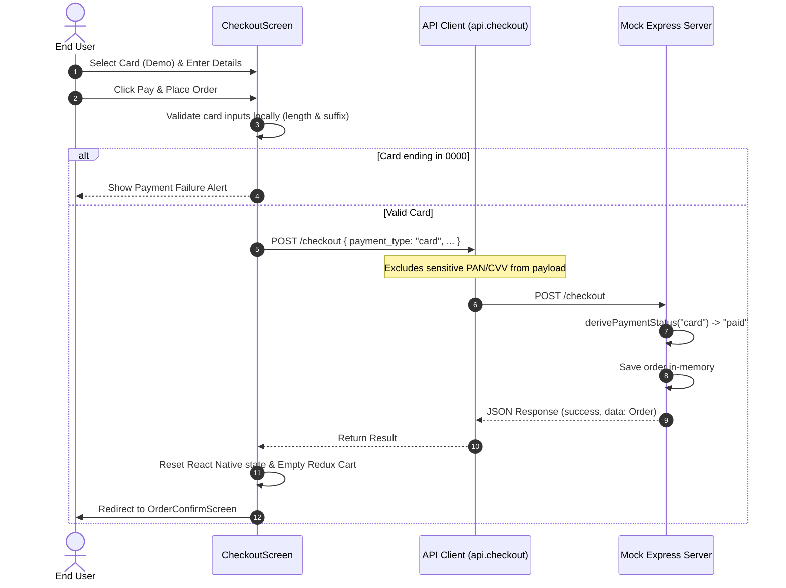
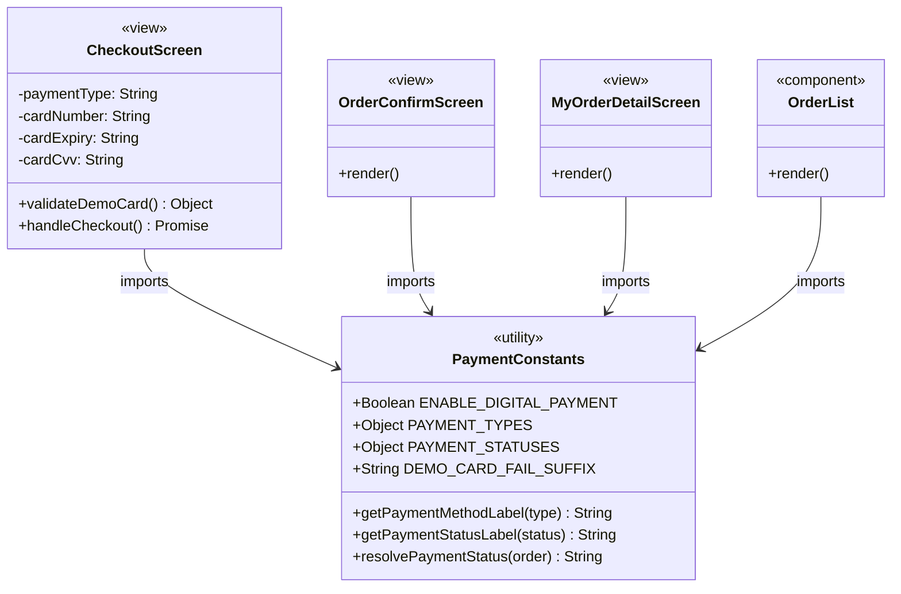
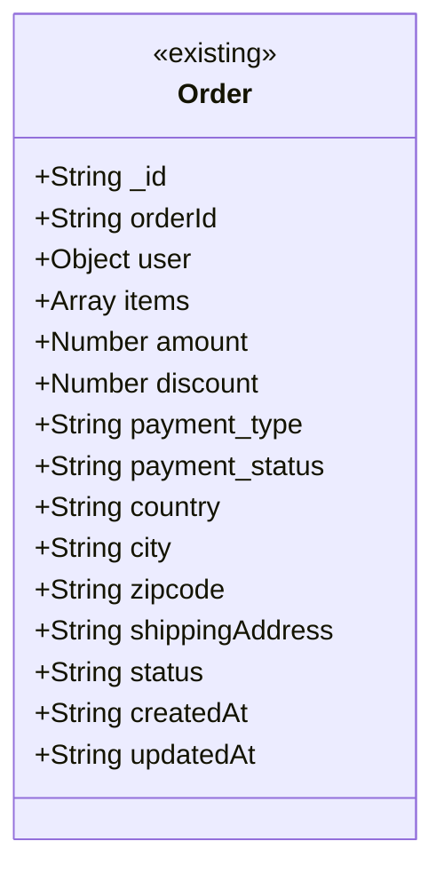

# Design: Digital Payment Integration (Agentic-SDLC-test/ecommerce-react-native-example#3)

> Linked Jira Epic: [Agentic-SDLC-test/ecommerce-react-native-example#3](https://github.com/Agentic-SDLC-test/ecommerce-react-native-example/issues/3)
> Business spec: v1 (submitted 2026-08-14T14:33:05.917358+00:00 by 46eff951-1630-4b97-bd1e-32cb00ef2efe)
> Architect: Gemini CLI

## Architecture overview

### Problem essence and value

We are enhancing the EasyBuy checkout flow to support simulated digital card payments alongside Cash on Delivery (COD). This modernizes the customer purchasing experience, reduces checkout friction, and ensures that order transactions record the payment type and status correctly on the backend, which is subsequently propagated to order confirmations and user order history. To ensure flexibility and safety, the entire digital payment flow is toggled via an environment flag `ENABLE_DIGITAL_PAYMENT`, and card details are processed purely in client-side transient state to prevent transmitting or storing PCI-sensitive data.

### Scope and boundaries

- **In scope**:
  - Interactive selection between "Cash on Delivery" and "Card (Demo)" on the checkout screen.
  - Conditional rendering of card inputs (Card Number, Expiry, CVV).
  - Local validation of card details (length, non-emptiness, ending suffix check).
  - Simulating transaction failure if the card number ends in `0000`.
  - Storing the selected payment type and status on the backend server (`payment_type: card` with `payment_status: paid`, or `payment_type: cod` with `payment_status: cod_pending`).
  - Rendering localized payment type and status labels across Order Confirmation, My Orders list, and Order Detail screens.
  - Integration of a feature flag `ENABLE_DIGITAL_PAYMENT` to control availability.
- **Out of scope**:
  - Integrating real, production-ready payment processors (e.g., Stripe, PayPal).
  - Captured card credentials stored on the server, local storage, or in application logs.
- **Conservative-reuse stance**:
  - Reuse the existing constants structure in `constants/Payment.js` and local utility helpers (`getPaymentMethodLabel`, `getPaymentStatusLabel`, `resolvePaymentStatus`).
  - Reuse the existing API client (`api/index.js`) for the `/checkout` request, passing `payment_type` in the order payload.
  - Utilize existing Redux actions to empty the cart upon successful checkout.

### High-level architecture

The architecture consists of a client-side React Native application communicating with a mock Node.js/Express server.
The client holds the card credentials in a transient React state within the `CheckoutScreen` component, verifying them locally before placing the order. Upon confirmation of valid demo details, the client calls the backend API endpoint `/checkout` with the order metadata and selected `payment_type`.
The Express server derives the corresponding `payment_status` using a synchronous mapping function based on `payment_type` and persists the order record in-memory.



### Key design decisions

- **Transient Card State** — To align with PCI-DSS guidelines, credit card details (Card Number, Expiry, CVV) are kept exclusively within local `useState` hooks on the `CheckoutScreen`. They are never bound to any global Redux store, never persisted in AsyncStorage, and never logged or sent to the backend API.
- **Feature Flag Control** — The feature is fully controlled via `ENABLE_DIGITAL_PAYMENT`. When disabled (`false`), the UI falls back entirely to COD, avoiding any redundant validation checks or conditional card input screens.
- **Server-Derived Payment Status** — Instead of relying on the client to declare whether an order has been paid, the server determines the `payment_status` dynamically upon receiving the `payment_type`. This ensures high data integrity and consistency.

### Alternatives considered

- **Sending Card Payload to Backend** — Rejected. Sending credit card numbers, expiry dates, or CVVs to the mock server would introduce major security risks and violate PCI-DSS compliance, even for dummy/simulation databases. Keeping simulation entirely local to the front-end ensures maximum safety.

## Affected repositories

- **Agentic-SDLC-test/ecommerce-react-native-example** (branch `main`, type `primary`) — Core repository containing the React Native client app (components, screens, and constants) and the mock API Express server.

## Component-level design

### Layered architecture and dependency map

The React Native client layer leverages state management (Redux) to track cart state, and utilizes modular api clients to communicate with the mock server.
The views rely on payment utility functions defined in `constants/Payment.js` to format labels across screens.



### Extension points

- `constants/Payment.js`: Ready to extend with other payment types (e.g., `PAYMENT_TYPES.WALLET` or `PAYMENT_TYPES.REDIRECT`) without breaking the current core structures.
- `derivePaymentStatus` (Server-side): Ready to process new payment workflows (e.g., webhook notifications or asynchronous pending checks).

### Conventions in use

- **Annotations / decorators**: None (React Native uses pure functional components and hooks).
- **Dependency injection**: React hooks and redux dispatch context. API endpoints are imported directly from `../../api`.
- **Exception handling**: Checked responses with visual error alerts utilizing `CustomAlert` components on the screen.
- **Input validation**: Handled locally inside `validateDemoCard` on `CheckoutScreen` before executing any network payloads.
- **Logging**: Console logging during runtime, explicitly omitting credentials.
- **Documentation**: JSDoc standard annotations for constants, utility helpers, and service routines.

### PaymentConstants (constants/Payment.js)

- **Responsibility**: Houses core payment config flags, payment codes, and translation functions to resolve user-friendly labels.
- **Collaborators**: Imported by all screens and components rendering payment states.
- **Methods**:
  - `getPaymentMethodLabel(type: String): String` — maps payment method key to localized name.
  - `getPaymentStatusLabel(status: String): String` — maps payment status key to localized status name.
  - `resolvePaymentStatus(order: Object): String` — fallback mapping for older order records in DB.

### CheckoutScreen (screens/user/CheckoutScreen.js)

- **Responsibility**: Provides the checkout checkout form, conditional card views, inputs validation, demo failure simulation, and checkout submission.
- **Collaborators**: Injects `redux` store for cart products, uses `api` client for order placement.
- **Methods**:
  - `validateDemoCard(): Object` — validates non-empty inputs, validates length is at least 12 digits, checks if the card ends with `DEMO_CARD_FAIL_SUFFIX`.
  - `handleCheckout(): Promise` — executes checkout logic, submits the payload to the backend API, and routes to order confirmation on success.

### Server (mock-server/server.js)

- **Responsibility**: Provides Express routes for client communication and manages order creation.
- **Collaborators**: Persists in-memory list of orders.
- **Methods**:
  - `derivePaymentStatus(paymentType: String): String` — Returns `paid` for `card`, or `cod_pending` for `cod`. Returns `null` for unsupported methods.

## UI/UX design notes

- **Checkout Form Selection**: Highlighting between "Cash on Delivery" and "Card (Demo)" as radio-list rows.
- **Form Visibility**: Selecting "Card (Demo)" dynamically expands a conditional section containing input boxes: `Card Number`, `Expiry (MM/YY)`, and `CVV`. Selecting "Cash on Delivery" collapses this section and resets the card input state.
- **Demo Banner**: A prominent helper text is displayed below the card selection to guide the tester: `"Demo payment only — no real charge. Use any test card; end with 0000 to simulate failure."`
- **ValidationError/Alerts**: Direct screen-level `CustomAlert` banners appear below the heading to notify the user of any incomplete inputs or simulation failures.

## API schemas and contracts

The API is served over HTTP via Express. The client invokes `/checkout` to create a new order.

```http
POST /checkout
Auth: Bearer <token>
Content-Type: application/json

Request Body:
{
  "items": [
    {
      "productId": "string",
      "price": number,
      "quantity": number
    }
  ],
  "amount": number,
  "discount": number,
  "payment_type": "string",
  "country": "string",
  "city": "string",
  "zipcode": "string",
  "shippingAddress": "string",
  "status": "string"
}

200 OK ->
{
  "success": true,
  "message": "Order placed successfully",
  "data": {
    "_id": "string",
    "orderId": "string",
    "user": {
      "_id": "string",
      "name": "string",
      "email": "string"
    },
    "items": [
      {
        "productId": {
          "_id": "string",
          "title": "string"
        },
        "price": number,
        "quantity": number
      }
    ],
    "amount": number,
    "discount": number,
    "payment_type": "string",
    "payment_status": "string",
    "country": "string",
    "city": "string",
    "zipcode": "string",
    "shippingAddress": "string",
    "status": "string",
    "createdAt": "ISO-8601 Timestamp",
    "updatedAt": "ISO-8601 Timestamp"
  }
}

400 Bad Request ->
{
  "success": false,
  "message": "Unsupported payment_type" or "Cart is empty"
}
```

## Integration patterns

- **Inbound**: REST endpoint `/checkout` on mock Express server triggers synchronous evaluation of `derivePaymentStatus` and database insertion.
- **Outbound**: Upon successful REST response, client dispatch handles Redux state cleanup via `emptyCart`.
- **Idempotency**: Orders generated on the client leverage standard UI submit disabling to prevent double submission during the `isloading` state.

## Data model changes

### Entity relationships



### Schema changes

- **New fields in Order model**:
  - `payment_type`: String (stores `"cod"` or `"card"`)
  - `payment_status`: String (stores `"cod_pending"`, `"paid"`, `"pending"`, or `"failed"`)
- Since the mock database resides in-memory on the Express server (`orders` array), no SQL migrations or persistent schemas are required. Newly created objects are automatically initialized with these fields.

### Backward-compatibility plan

- Older order objects saved in database memory that lack `payment_status` will be processed on the client using `resolvePaymentStatus(order)`. This helper dynamically maps `payment_type === "cod"` to `cod_pending` and fallback-resolves all other historical items to `pending`.

## Security and compliance considerations

- **Auth**: Endpoints require JWT authorization tokens sent inside HTTP `Authorization` headers.
- **Secrets**: No external integration secrets are introduced.
- **PII / PCI-DSS compliance**: Card Number, Expiry, and CVV are captured in local screen state. They are strictly omitted from the API `/checkout` payload. They are cleared upon transaction completion, card rejection, or switching payment types.
- **No logs / persistence**: PAN or CVV must never be logged on console or mock server terminal.

## Observability requirements

- **Structured logs**:
  - Log checkout success metadata: `console.log("Checkout success", { orderId, payment_type, payment_status })`
  - Log checkout failures: `console.log("Demo card payment failed", validation.message)`
- **Metrics**: None required for mock environment.

## Required agent skills

- `code-generation` — to run, modify, or extend codebase files.
- `validation` — to run Jest checks and verify overall syntax structures.

## Implementation plan

The solution is already integrated across the codebase. We specify the verification plan to ensure complete regression protection.

### Phase 1 — Constants & Helpers

1. **Verify Constants** — Review `constants/Payment.js` to confirm `ENABLE_DIGITAL_PAYMENT`, `PAYMENT_TYPES`, `PAYMENT_STATUSES`, labels mapping, and helpers (`getPaymentMethodLabel`, `getPaymentStatusLabel`, `resolvePaymentStatus`).
2. **Execute Constants Unit Tests** — Validate using `npm test payment.test.js`.

### Phase 2 — Server Integration

1. **Verify Server Routing** — Review `mock-server/server.js` route handler `app.post("/checkout")` to confirm that it parses `payment_type` and applies `derivePaymentStatus()`.
2. **Execute Server Verification** — Start mock-server (`npm start` or direct node execution) and test order creation with different `payment_type` codes.

### Phase 3 — Front-end UI Components

1. **Verify Checkout Selection** — Open checkout screen, confirm `ENABLE_DIGITAL_PAYMENT` toggle correctly displays/hides the "Card (Demo)" option.
2. **Verify Inputs & Alerts** — Confirm card form expands correctly, local validation fires when inputs are incomplete or card number contains fewer than 12 digits, and mock payment failure triggers for card numbers ending in `0000`.
3. **Verify Post-purchase details** — Place successful COD and Card orders, verify payment details are displayed correctly on the Order Confirmation, My Orders listing, and Order Detail screens.

## Test strategy

### Test layers

- **Unit Tests**:
  - `payment.test.js`: Validates constants, fallback methods, label resolution, and status resolving routines under multiple order structures.
- **Manual Integration/QA testing**:
  - Verify Checkout UI payment method toggling, inputs rendering, input length checks, demo-fail suffix checking, and post-checkout display states.

### Acceptance Criteria coverage

| AC# | Description | Covered by | Notes |
| --- | ----------- | ---------- | ----- |
| 1 | Toggle payment selection | `CheckoutScreen.js` conditional block | Handled via `ENABLE_DIGITAL_PAYMENT` |
| 2 | Card inputs form visibility | `CheckoutScreen.js` UI rendering | Selection expands/collapses form |
| 3 | Local card inputs validation | `CheckoutScreen.js` `validateDemoCard` | Validates empties and length (< 12) |
| 4 | Payment failure suffix simulation | `CheckoutScreen.js` `validateDemoCard` | Blocks card ending in `0000` |
| 5 | Order database persistence | Mock Server `server.js` | Saves `payment_type` and `payment_status` |
| 6 | Order Confirmation details display | `OrderConfirmScreen.js` UI | Renders payment labels and statuses |
| 7 | Order History and Details labels | `components/OrderList`, `MyOrderDetailScreen` | Resolves localized labels correctly |
| 8 | Feature Flag toggle check | `constants/Payment.js` | Disabling flag hides option, skips check |

### Performance targets and quality bars

- **Safety**: 100% compliance with local-only validation. Zero transmission of CVV or card PAN fields across network lines.

### Flake risks and fixtures

- **In-Memory Store Reset**: Mock server store resets on restart. Ensure testing accounts for order recreation.

## Rollout and rollback considerations

- **Feature flag**: Controlled by `ENABLE_DIGITAL_PAYMENT` flag exported from `constants/Payment.js`. Set to `true` to enable features globally, and `false` to rollback to Cash on Delivery (COD) only.
- **Rollback plan**: Set `ENABLE_DIGITAL_PAYMENT = false`. This removes card option from screen UI, hides card inputs, bypasses validation steps, and forces payment defaults to Cash on Delivery automatically.

## Validation summary

- **Jira Epic**: `Agentic-SDLC-test/ecommerce-react-native-example#3`
- **Acceptance Criteria coverage**:
  - AC-1, AC-2, AC-3, AC-4, AC-8 → satisfied by front-end client-side logic on `CheckoutScreen.js`.
  - AC-5 → satisfied by Express routing logic on mock `server.js`.
  - AC-6 → satisfied by mapping helpers inside `OrderConfirmScreen.js`.
  - AC-7 → satisfied by `MyOrderDetailScreen.js` and `components/OrderList/OrderList.js`.
- **Open questions**: None.
- **Known risks accepted**:
  - The in-memory database of mock server is transient and clears upon server restart. This is accepted for simulation/development environment.