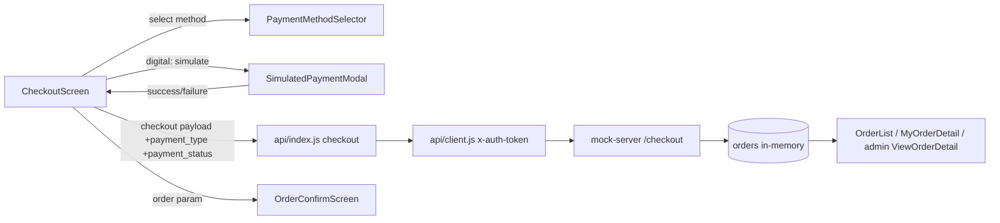
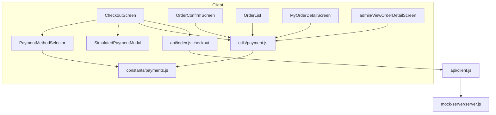
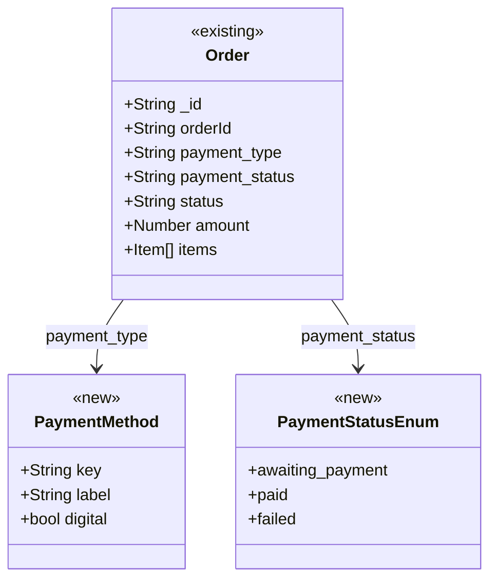

# Design: Digital Payment Options at Checkout (Agentic-SDLC-test/ecommerce-react-native-example#3)

> Linked Jira Epic: [Agentic-SDLC-test/ecommerce-react-native-example#3](https://github.com/Agentic-SDLC-test/ecommerce-react-native-example/issues/3)
> Business spec: v1 (submitted 2026-09-10 by c1a22397-e146-4fff-b0fd-606b23112883)
> Architect: _pending_

## Architecture overview

### Problem essence and value

Give shoppers a real payment choice at checkout — Cash on Delivery **plus** at least one simulated digital path — record on every order both the chosen method and a payment state, and surface that state consistently on the confirmation screen, order history, and order detail. Two implicit requirements Ideation left unstated: (a) payment wording must come from **one** shared source so checkout, confirmation, and history never drift (BR-9); (b) orders created before this change (and the in-memory seeds) lack the new field, so every reader must render safely when `payment_status` is absent (BR-7).

### Scope and boundaries

- **In scope**: a payment-method selector at checkout; a simulated digital payment step (card-placeholder form — Q-1 working assumption); persisting `payment_type` plus a new `payment_status` on orders; surfacing method + state on `OrderConfirmScreen`, `OrderList`, `MyOrderDetailScreen`, and read-only on admin `ViewOrderDetailScreen`; a shared payment vocabulary (`constants/payments.js` + `utils/payment.js`); `mock-server/server.js` `/checkout` and seed changes; unit/component tests.
- **Out of scope**: real gateway/money movement, real card data, PCI scope, refunds/split/saved cards, any change to the fulfillment lifecycle (`pending`/`shipped`/`delivered`), the admin order-status workflow, or the amount calculation.
- **Conservative-reuse stance**: reuse the `api/index.js` `checkout()` seam **unchanged** (it already forwards an arbitrary payload object); reuse the existing `Modal` + `CustomInput` + `CustomButton` pattern already present in `CheckoutScreen` (the address modal) for the simulated payment step; reuse `OrderList` as the single history row for both user and admin; **extend the order object with one field** rather than introduce a new entity or store; mirror the already-unit-tested pure-helper pattern (`__tests__/reviews.test.js`) for payment labels. No refactor of the Redux cart, navigation, or `api/client.js`.

### High-level architecture

The app is a React Native / Expo client (JavaScript, functional components + hooks, Redux only for the cart) talking to a flat REST seam. Screens never call `fetch` directly — they call named operations in `api/index.js`, which delegate to `api/client.js` (which attaches the `x-auth-token` header). Orders are created by `POST /checkout` and read by `GET /orders` (user) and `GET /admin/orders` (admin). Both the Node backend and the mock-server serve the same flat `{ success, data, message }` contract.

Payment is **simulated entirely on the client**: `CheckoutScreen` runs the mock payment step, computes the resulting `payment_status`, and sends it alongside the existing checkout payload. The mock server merely persists and echoes the field. This keeps the change additive and honours the mocked-backend constraint — **no payment-intent endpoint is introduced**, and reads flow the new field through automatically because they already return the full order object.



### Key design decisions

- **Client-side simulation, server only persists state** — no new endpoint. Trade-off: the server is not the source of truth for payment success. Acceptable because payments are explicitly mocked, and it reuses the single existing `/checkout` write path instead of adding a second one.
- **One new order field `payment_status` (enum), kept separate from `status` (fulfillment)** — mitigates the Ideation risk of conflating "paid" with "delivered"; the fulfillment `StepIndicator` is untouched.
- **Shared payment vocabulary in `constants/payments.js` + `utils/payment.js`** — guarantees BR-9 consistency across every screen and gives a pure-function unit-test target mirroring the existing reviews helper.
- **COD stays the default selection** — preserves BR-7 (COD unchanged for shoppers) and guarantees a method is always selected so the order can be submitted.

### Alternatives considered

- **A new `/payments` / payment-intent endpoint with a server-side state machine** — rejected: over-engineered for a mocked flow, adds a second write path, and contradicts the conservative-reuse stance.
- **A Redux slice for payment selection** — rejected: selection is transient, screen-local checkout state; `useState` matches how `CheckoutScreen` already holds the address fields.
- **Redirect-style WebView flow as the first digital path** — deferred to Q-1: heavier (needs a return route and navigation plumbing) than a self-contained card placeholder for the epic's "at least one" requirement.

## Affected repositories

- **Agentic-SDLC-test/ecommerce-react-native-example** (branch `temp_main_2`, type `primary`) — RN client screens/components/constants/utils for method selection, simulated payment, and payment display; `mock-server/server.js` for persisting `payment_status` and updated seed data; Jest unit/component tests.

> Single repository per `repository_targets[]`; no change falls outside it.

## Component-level design

### Layered architecture and dependency map



### Extension points

- `PAYMENT_METHODS` in `constants/payments.js` is the single place to add a wallet or redirect path later (Q-1). `SimulatedPaymentModal` switches on the method's `digital` flag, leaving room for a wallet/redirect variant without touching `CheckoutScreen` wiring.
- An optional `SHOW_DIGITAL` constant is available as a lightweight kill-switch (see Rollout).

### Conventions in use

- **Components/decorators**: functional components + hooks (`useState`, `useEffect`, `useSelector`); JavaScript only, no TypeScript, no class components or annotations.
- **Dependency injection**: none — direct ES module imports; Redux actions via `bindActionCreators` for cart only.
- **API access**: call named operations in `api/index.js`; never call `fetch` directly; responses are `{ success, data, message }`.
- **Input validation**: screen-level guards with `useState`; Submit is gated (address fields) today — payment selection reuses the same inline-guard style.
- **Exception handling**: screens set an error string and render `CustomAlert` / `console.log`; no thrown exceptions. Loading via `react-native-progress-dialog`. Token-expiry handling stays centralized in `api/client.js`.
- **Logging**: `console.log` at API boundaries (existing convention).
- **Documentation / testing**: brief `//` comments; `testID` on every interactive and text node (strict existing convention — new nodes must carry `testID`).

### constants/payments.js (new)

- **Responsibility**: single source of payment method + status enums and display copy.
- **Collaborators**: none (leaf module).
- **Exports**:
  - `PAYMENT_METHODS = [{ key: 'cod', label: 'Cash on Delivery', digital: false }, { key: 'card', label: 'Card (Placeholder)', digital: true }]`
  - `PAYMENT_STATUS = { AWAITING: 'awaiting_payment', PAID: 'paid', FAILED: 'failed' }`
  - `PAYMENT_STATUS_LABELS = { awaiting_payment: 'Awaiting payment', paid: 'Paid', failed: 'Payment failed' }`
  - `DEFAULT_METHOD = 'cod'`
- **Transaction/concurrency boundary**: none (constants).

### utils/payment.js (new)

- **Responsibility**: pure helpers for payment vocabulary and state derivation.
- **Collaborators**: `constants/payments.js`.
- **Methods**:
  - `getPaymentMethodLabel(methodKey): string` — returns the method label; unknown/legacy → `'Cash on Delivery'` fallback.
  - `isDigitalMethod(methodKey): boolean` — true when the method's `digital` flag is set.
  - `getPaymentStatusLabel(status, methodKey): string` — maps enum → copy; missing/unknown status → `'Cash on delivery — pay on arrival'` when `methodKey === 'cod'`, else `'Awaiting payment'` (backward compat, BR-7).
  - `resolvePaymentStatus(methodKey, { success }): string` — `cod` → `AWAITING`; digital + success → `PAID`; digital + !success → `FAILED`.
- **Annotations/decorators**: none.
- **Transaction/concurrency boundary**: none (pure functions) — unit-tested like `__tests__/reviews.test.js`.

### components/PaymentMethodSelector/PaymentMethodSelector.js (new)

- **Responsibility**: render a controlled, selectable list of `PAYMENT_METHODS`.
- **Collaborators**: `constants/payments.js`, `constants` colors, `@expo/vector-icons` Ionicons.
- **Methods**: functional component. **Props** `{ selected, onSelect, testID }`. Renders one row per method with a radio indicator + label; `onPress` → `onSelect(key)`; each row carries `testID={`payment-method-${key}`}`.
- **Transaction/concurrency boundary**: none.

### components/SimulatedPaymentModal/SimulatedPaymentModal.js (new)

- **Responsibility**: present a clearly-marked **simulated** card-placeholder form and return a pay/cancel outcome.
- **Collaborators**: reuses `Modal` + `CustomInput` + `CustomButton` (same pattern as the address modal in `CheckoutScreen`), `constants` colors.
- **Methods**: functional component. **Props** `{ visible, method, onPay, onCancel, testID }`. Local `useState` for placeholder card number / expiry / CVC (never validated, never sent, never stored). Shows a visible banner `Simulated — no real payment is taken`. `Pay` → `onPay({ success: true })`; a distinct `testID`-exposed `Simulate failure` control (Q-3) → `onPay({ success: false })`; `Cancel` → `onCancel()`.
- **Transaction/concurrency boundary**: none; card fields are discarded on close.

### screens/user/CheckoutScreen.js (modified)

- **Responsibility**: gain method selection + simulated payment before placing the order.
- **Collaborators**: `PaymentMethodSelector`, `SimulatedPaymentModal`, `utils/payment.js`, `api.checkout`.
- **Changes / methods**:
  - New state: `paymentMethod` (default `'cod'`), `paymentModalVisible`, `paymentError`.
  - Replace the static `Cash On Delivery` block (the `checkout-method-value` node) with `<PaymentMethodSelector selected={paymentMethod} onSelect={setPaymentMethod} />`.
  - `handleCheckout()`: if `isDigitalMethod(paymentMethod)` and payment not yet completed → open `SimulatedPaymentModal` instead of posting. On modal `onPay({ success })` compute `paymentStatus = resolvePaymentStatus(paymentMethod, { success })`; on failure set `paymentError` and keep the user on the screen so they can retry or switch to COD (BR-8); on success close modal and continue to post. COD posts immediately with `awaiting_payment`.
  - Checkout payload adds `payment_type: paymentMethod` and `payment_status: paymentStatus` (replacing the hardcoded `payment_type: 'cod'`).
  - On `result.success`: `emptyCart('empty')`, then `navigation.replace('orderconfirm', { order: result.data })`.
  - Preserve the existing address-based Submit gating.
- **Transaction/concurrency boundary**: single `POST /checkout`; no order is posted when a digital payment fails.

### screens/user/OrderConfirmScreen.js (modified)

- **Responsibility**: reflect the payment method and state right after purchase (BR-5).
- **Changes**: read `route.params.order`; render one payment line via helpers, e.g. `Paid by Card` or `Cash on delivery — pay on arrival`. Falls back to the existing generic confirmation text when `order` is absent (defensive).

### components/OrderList/OrderList.js (modified)

- **Responsibility**: show payment method + state per order alongside fulfillment status (BR-6). Shared by user (`MyOrderScreen`) and admin (`ViewOrdersScreen`).
- **Changes**: add a row rendering `getPaymentMethodLabel(item?.payment_type)` and a payment-state badge `getPaymentStatusLabel(item?.payment_status, item?.payment_type)`, distinct from the existing `item?.status` (fulfillment). New nodes carry `testID` `${testID}-payment-method` and `${testID}-payment-status`.

### screens/user/MyOrderDetailScreen.js (modified)

- **Responsibility**: show a labelled Payment section on order detail (BR-6, AC8).
- **Changes**: add a Payment block near Order Info rendering method + state via helpers, independent of the fulfillment `StepIndicator`.

### screens/admin/ViewOrderDetailScreen.js (modified)

- **Responsibility**: show read-only payment method + state to admins (Ideation admin-visibility working assumption: yes, read-only).
- **Changes**: add a read-only Payment section via helpers. No admin mutation of payment state; `/admin/order-status` remains fulfillment-only.

### mock-server/server.js (modified)

- **Responsibility**: persist and echo `payment_status`.
- **Changes**: in `POST /checkout`, destructure `payment_status` from the body and set `newOrder.payment_status = payment_status || (payment_type === 'card' ? 'paid' : 'awaiting_payment')`; keep `payment_type` default `'cod'`. Add `payment_status: 'awaiting_payment'` to the three seed orders (COD orders remain awaiting payment even when delivered — cash collected on delivery; add a clarifying comment). `GET /orders` and `GET /admin/orders` are unchanged (they already echo the full order). `/admin/order-status` untouched.

## UI/UX design notes

- The checkout **Payment** section becomes a selectable radio-style list of COD + Card; the selected method is visibly highlighted; COD is preselected (AC1, AC2, AC9).
- Choosing **Card** and pressing **Submit Order** opens a modal card-placeholder form clearly labelled *Simulated / placeholder*. **Pay** confirms; a secondary control **Simulate failure** exercises the failure path (Q-3); **Cancel** returns to checkout with the method still selected (AC3).
- On failure, an inline alert reads *Payment failed — try again or choose another method*; the user can retry or switch to COD (AC11).
- `OrderConfirmScreen` shows one plain-language payment line under the success image (AC6).
- `OrderList` shows a compact pair such as `Card · Paid` / `COD · Awaiting payment`, visually separate from the fulfillment status to avoid confusing the two (AC7).
- `MyOrderDetailScreen` and admin `ViewOrderDetailScreen` show a labelled Payment block (AC8). All wording is sourced from `utils/payment.js` so the same order reads identically everywhere (BR-9).
- The change uses only RN primitives and the app's existing cross-platform `Modal`, so it works on iOS, Android, and web (AC10, BR-10).

## API schemas and contracts

The flat REST seam is reused unchanged through `api/index.js`; authentication is the JWT `x-auth-token` header attached by `api/client.js`. Only `POST /checkout` changes shape — it gains two fields (`payment_type` now an enum, plus the new `payment_status`). Read endpoints are unchanged and simply echo the richer order object.

Enums: `payment_type` ∈ `{ "cod", "card" }`; `payment_status` ∈ `{ "awaiting_payment", "paid", "failed" }`.

```http
POST /checkout
Auth: x-auth-token: <token>
Request -> {
  "items": [{ "productId": "string", "price": 19.99, "quantity": 2 }],
  "amount": 129.97,
  "discount": 0,
  "payment_type": "card",            // "cod" | "card"
  "payment_status": "paid",          // "awaiting_payment" | "paid" | "failed"
  "country": "string",
  "city": "string",
  "zipcode": "string",
  "shippingAddress": "string",
  "status": "pending"                 // fulfillment, unchanged
}
200 OK -> {
  "success": true,
  "message": "Order placed successfully",
  "data": {
    "_id": "string",
    "orderId": "ORD-<timestamp>",
    "payment_type": "card",
    "payment_status": "paid",
    "status": "pending",
    "amount": 129.97,
    "items": [ ... ],
    "createdAt": "ISO-8601",
    "updatedAt": "ISO-8601"
  }
}
400 Bad Request -> { "success": false, "message": "Cart is empty" }
401 Unauthorized -> { "success": false, "message": "No token provided" }
```

```http
GET /orders            (user's own)      Auth: x-auth-token
GET /admin/orders      (admin: all)      Auth: x-auth-token (ADMIN)
200 OK -> {
  "success": true,
  "data": [ { "orderId": "string", "payment_type": "cod", "payment_status": "awaiting_payment", "status": "pending", ... } ]
}
```

No event contracts apply — the app has no message bus.

## Integration patterns

- **Inbound**: RN screens → `api/index.js` (`checkout()`, `getOrders()`, `getAdminOrders()`) → `api/client.js` (adds `x-auth-token`) → mock-server. No new operation is added; `checkout()` already forwards an arbitrary payload object, so the two new fields flow through unchanged.
- **Outbound**: none — no third-party gateway is called (payments are mocked). A future real integration would add a payment-intent call at this seam; explicitly deferred.
- **Idempotency / retry**: checkout stays a single `POST`. A failed simulated payment does **not** post an order, so a retry creates no duplicate; no dedupe key is required.

## Data model changes

### Entity relationships



### Schema changes

- **No SQL database** — orders live in-memory in `mock-server/server.js` (`orders[]`). The order object gains `payment_status: string` (enum `awaiting_payment` | `paid` | `failed`). `payment_type` is widened from a fixed `'cod'` to the enum `cod` | `card`.
- **Client**: `constants/payments.js` defines the enums; `utils/payment.js` maps them to labels.
- No indexes apply (in-memory array).

### Backward-compatibility plan

- Legacy orders (or any seed not yet updated) may lack `payment_status`. The helpers treat a missing/unknown status as a COD-safe default so history and detail render without error (BR-7). Seeds are updated to carry the field in the same change. No migration or backfill is needed — mock data is in-memory and resets on restart.

## Security and compliance considerations

- **Auth**: unchanged. `/checkout` and `/orders` sit behind `authMiddleware` (`x-auth-token`); `/admin/orders` behind `adminMiddleware`. No new endpoints and no new auth surface.
- **Secrets**: none introduced.
- **PII / data classification**: simulated card fields are **never** sent, persisted, or logged — they live in modal-local state and are discarded on close. No cardholder data enters the payload or the server, keeping the change out of PCI scope by design (explicit non-goal).
- **Audit log entries**: none required for a mock; `payment_type` + `payment_status` on the order provide the data trail the PO needs for future reporting.
- **Regulatory constraints**: none — no real payments; explicit Ideation non-goal.

## Observability requirements

- **Structured logs**: keep the existing `console.log` boundary pattern. In `CheckoutScreen`, log the payment outcome without card data: `console.log('payment', { method: paymentMethod, status: paymentStatus })`. In mock-server `/checkout`, log `{ orderId, payment_type, payment_status }`.
- **Metrics**: not applicable — the client app and mock server have no metrics pipeline.
- **Traces**: not applicable.
- **Dashboards / alerts**: not applicable — noted explicitly so the omission is intentional, not overlooked.

## Implementation plan

### Phase 1 — Shared vocabulary

1. **Add `constants/payments.js`** (`PAYMENT_METHODS`, `PAYMENT_STATUS`, `PAYMENT_STATUS_LABELS`, `DEFAULT_METHOD`). Verify: imports without a cycle; re-export from `constants/index.js` if consistent with existing style.
2. **Add `utils/payment.js`** (`getPaymentMethodLabel`, `isDigitalMethod`, `getPaymentStatusLabel`, `resolvePaymentStatus`). Verify: `__tests__/payment.test.js` covers `cod`/`card` × success/failure and legacy/unknown inputs (mirrors `__tests__/reviews.test.js`).

### Phase 2 — Backend (mock-server)

1. **Update `POST /checkout`** to destructure and persist `payment_status` with the derive-fallback. Verify: a manual `POST` returns `payment_status` in `data`.
2. **Add `payment_status: 'awaiting_payment'`** to the three seed orders. Verify: `GET /orders` shows the field.

### Phase 3 — Checkout UI

1. **Add `PaymentMethodSelector`** component. Verify: renders a row per method with correct `testID`s.
2. **Add `SimulatedPaymentModal`** component (card placeholder + `Simulate failure`). Verify: `Pay`/`Simulate failure`/`Cancel` invoke the right callbacks.
3. **Wire `CheckoutScreen`**: selector, modal, `resolvePaymentStatus`, payload fields, `navigation.replace('orderconfirm', { order })`. Verify: component test — selecting `card` opens the modal; `Pay` posts with `payment_status: 'paid'`; failure keeps the user on the screen with an alert; COD posts immediately.

### Phase 4 — Display surfaces

1. **`OrderConfirmScreen`** reads the `order` param and shows the payment line.
2. **`OrderList`** adds method + state.
3. **`MyOrderDetailScreen`** adds a Payment section.
4. **admin `ViewOrderDetailScreen`** adds a read-only Payment section. Verify: render tests assert the helper labels via `testID`; a legacy order without `payment_status` renders the fallback.

### Phase 5 — Hardening

1. Run `npm run lint` and `npm test`; confirm iOS/Android/web parity (RN primitives only, no platform-specific code). Verify: lint and tests green.

## Test strategy

### Test layers

- **Unit (Jest)**: `utils/payment.js` — `resolvePaymentStatus` and all label mappings including legacy/unknown, mirroring `__tests__/reviews.test.js`.
- **Component (jest-expo)**: `CheckoutScreen` selection → modal → submit (COD and card success), the failure path, and payment-label rendering on `OrderConfirmScreen` / `OrderList` / `MyOrderDetailScreen` via `testID`.
- **Integration (manual against mock-server)**: place COD and card orders; confirm `payment_status` is persisted and echoed by `GET /orders`.
- **Smoke**: app boots on web; the checkout flow is reachable end-to-end.

### Acceptance Criteria coverage

| AC# | Description | Covered by | Notes |
| --- | --- | --- | --- |
| 1 | Choose COD or a digital path, selection visible | `PaymentMethodSelector` render + selection test | Phase 3 |
| 2 | Cannot place order without a method; COD works | default `cod` + Submit gating test | Phase 3 |
| 3 | Digital path shows a simulated step, no real data | `SimulatedPaymentModal` test | Phase 3 |
| 4 | Order stores chosen method | checkout payload + mock-server persist test | Phase 2/3 |
| 5 | Order stores consistent payment state | `resolvePaymentStatus` unit + persist test | Phase 1/2 |
| 6 | Confirmation shows method + state | `OrderConfirmScreen` render test | Phase 4 |
| 7 | History list shows method + state | `OrderList` render test | Phase 4 |
| 8 | Detail shows method + state | `MyOrderDetailScreen` render test | Phase 4 |
| 9 | COD experience unchanged | COD path test | Phase 3 |
| 10 | Works on iOS/Android/web | RN-primitive review + web smoke | Phase 5 |
| 11 | Failure informs + allows retry (Q-3) | failure-path component test | Phase 3; conditional on Q-3 |

### Performance targets and quality bars

- No perceptible latency change — one extra client modal and **no** new network call for the simulation.
- **Data validation rules**: a method is always selected (default `cod`); no order is posted on a failed digital payment; `payment_status` must be one of the enum values; simulated card fields never leave the device (asserted by inspecting the payload in the checkout test).
- **Resource limits**: unchanged; no new payload growth beyond two short string fields.

### Flake risks and fixtures

- Date formatting in `OrderList`/`MyOrderDetailScreen` — pass fixed ISO timestamps in fixtures.
- Modal visibility timing in RN tests — assert via `testID` + state, not animation waits.

## Rollout and rollback considerations

- **Feature flag**: not warranted for a mock-only additive UI change; the COD default preserves prior behaviour. Optional lightweight gate: a `SHOW_DIGITAL` constant in `constants/payments.js` (off hides the digital option) — noted, not required.
- **Canary**: not applicable (client app; EAS staging build via existing profiles).
- **Backfill / migration ordering**: none — data is in-memory and seeds are updated in the same change.
- **Rollback plan**: revert the branch; the new field is additive and ignored by older readers, so no data cleanup is needed.
- **Monitoring during rollout**: watch console payment logs; verify the COD path is unchanged (regression check) on iOS, Android, and web.

## Validation summary

- **Jira Epic**: `Agentic-SDLC-test/ecommerce-react-native-example#3`
- **Acceptance Criteria coverage**:
  - AC1 / AC2 → `PaymentMethodSelector` + `DEFAULT_METHOD = cod` (Phase 3).
  - AC3 → `SimulatedPaymentModal` (Phase 3).
  - AC4 / AC5 → checkout payload + `resolvePaymentStatus` + mock-server persist (Phases 1–3).
  - AC6 → `OrderConfirmScreen` (Phase 4).
  - AC7 → `OrderList` (Phase 4).
  - AC8 → `MyOrderDetailScreen` (Phase 4).
  - AC9 → COD default + unchanged post path (Phase 3).
  - AC10 → RN primitives only, existing cross-platform `Modal` (Phase 5).
  - AC11 → failure path + retry/fallback (Q-3, Phase 3).
- **Open questions**: Q-1 (which digital path — designed with a card-placeholder assumption), Q-2 (payment states — designed with `awaiting_payment` / `paid` / `failed`), Q-3 (failure simulation — designed in, behind a gated affordance). Admin read-only visibility assumed **yes**.
- **Known risks accepted**: client-side payment truth (acceptable for a mocked flow); the simulated modal must stay visibly marked to avoid being mistaken for real payment (mitigated by an explicit banner).