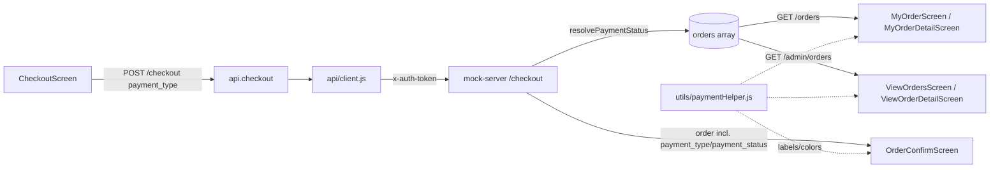
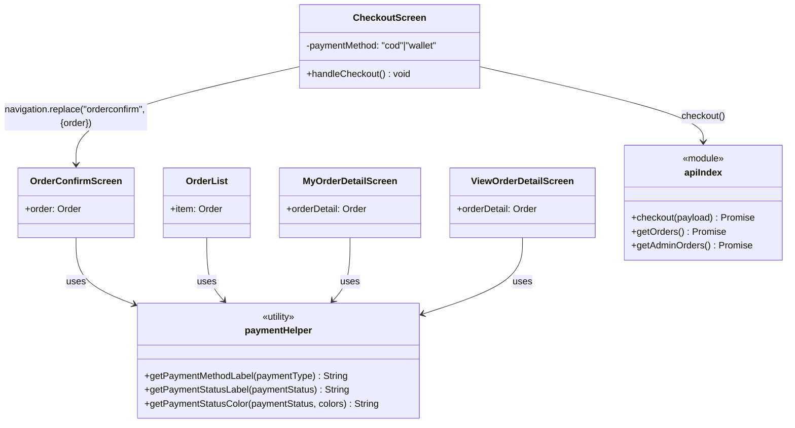
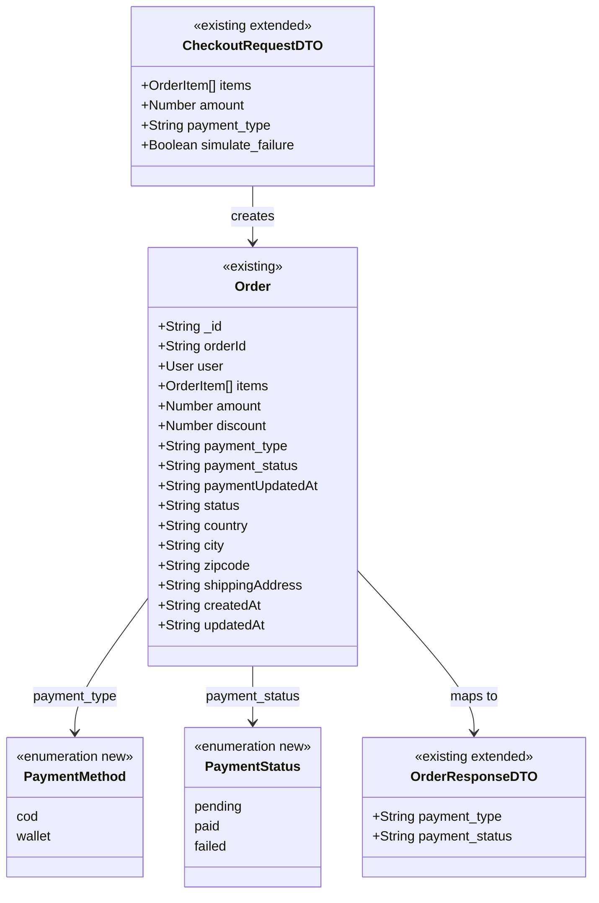

# Design: Digital Payment Options at Checkout (Agentic-SDLC-test/ecommerce-react-native-example#3)

> Linked Jira Epic: [Agentic-SDLC-test/ecommerce-react-native-example#3](https://github.com/Agentic-SDLC-test/ecommerce-react-native-example/issues/3)
> Business spec: v1 (submitted 2026-09-18 18:34 UTC by user `31a60717-6a6d-46f6-9afd-7d447a532689`)
> Architect: ALORA Design Agent

## Architecture overview

### Problem essence and value

Let a customer choose how they pay — Cash on Delivery or a mocked digital
method — and make that choice, and its outcome, travel with the order
everywhere the order is shown. The value is removing a real checkout
blocker for customers who don't want to pay cash, and giving the business
its first notion of "paid" vs. "unpaid," distinct from delivery progress.
An implicit requirement surfaced during exploration: `payment_type` already
exists end-to-end (`CheckoutScreen` → `POST /checkout` → the `orders` array)
but is hardcoded to `"cod"` and never rendered anywhere — so half of BR-1/BR-2
is dead code today; this design activates it rather than inventing a parallel
field.

### Scope and boundaries

- **In scope**: a payment-method choice on `CheckoutScreen`, a new
  `payment_status` field on the `Order` domain model (mock-server `orders`
  array), server-side simulation of a digital-payment outcome inside the
  existing `POST /checkout` call, and displaying payment method + status on
  `OrderConfirmScreen`, `MyOrderScreen`/`MyOrderDetailScreen` (customer), and
  `ViewOrdersScreen`/`ViewOrderDetailScreen` (admin).
- **Out of scope**: any real payment gateway integration, real card capture,
  refunds/partial/split payments, guest checkout, and any change to how COD
  orders behave today (BR-7).
- **Conservative-reuse stance**: `payment_type` on `Order` is **extended**
  (allowed values grow from `{"cod"}` to `{"cod", "wallet"}`); `status`
  (delivery) is **untouched** — a sibling `payment_status` field is added
  instead of overloading it, per the business spec's explicit risk mitigation
  against conflating the two. `OrderList.js` (already shared by the
  customer's `MyOrderScreen` and admin's `ViewOrdersScreen`) is **extended**
  in place so both surfaces pick up the new fields from one change. No new
  screens, no new navigation routes, and no new backend endpoint are
  introduced for the default path — the existing single-call checkout flow
  is reused (see "Key design decisions").

### High-level architecture

The app already funnels every screen's network access through
`api/index.js` → `api/client.js` (adds `x-auth-token`, centralizes "jwt
expired" handling) → the mock Express server in `mock-server/server.js`
(an in-memory array, no DB). This design keeps that shape: no new client
module, no new server dependency. The only structural addition is a small
pure-function helper module, `utils/paymentHelper.js`, mirroring the
existing `utils/reviewHelper.js` pattern, so payment-method/status labels
and colors are computed once and reused by every screen that renders them
(`OrderConfirmScreen`, `OrderList`, `MyOrderDetailScreen`,
`ViewOrderDetailScreen`) instead of four copies of the same `if/else`.



### Key design decisions

- **Simulate the digital payment inside the existing `POST /checkout` call**
  rather than adding a second "authorize payment" endpoint or a client-side
  delay/poll — the Epic explicitly calls for a "mock"/"placeholder" path, the
  server already computes the whole order synchronously, and a second round
  trip would add failure modes (partial order, orphaned payment) with no
  product benefit. Trade-off: a real gateway would need an async callback;
  that is explicitly out of scope (non-goal) and can replace this
  simulation later without moving the field off the `Order`.
- **Ship exactly one digital method first — a mocked "Wallet (Demo)"
  option** — no user-entered fields, so no even-mock card capture, no new
  form component, and no validation surface. See **Q-1**; card-placeholder
  and redirect-style flows are left as extension points.
- **`payment_status` is a new sibling field on `Order`, not a new value
  merged into the existing delivery `status` enum** — directly satisfies
  BR-3 and the business spec's own risk mitigation ("the two must never be
  merged or conflated"). `GET /admin/order-status` continues to manage only
  delivery `status`.
- **A failed digital payment still creates the order**, with
  `payment_status: "failed"` — see **Q-2**. This keeps the cart→order
  transition atomic and gives the customer and admin something concrete to
  look at (an order they can see is unpaid) instead of silently dropping
  their cart.
- **Admin payment status starts read-only** (system-set by the checkout
  simulation, no manual override control) — see **Q-3**. The existing
  delivery-status `DropDownPicker` on `ViewOrderDetailScreen` is left
  untouched; a payment-status override endpoint is described as an
  extension point rather than built, so this can be added later without
  restructuring the order model.

### Alternatives considered

- **New `Payment` sub-document / dedicated `/payments` table** — rejected:
  the mock-server has no DB, no ORM, and no sub-resource convention anywhere
  in the codebase (every existing entity — `products`, `categories`,
  `orders`, `reviews` — is a flat array of flat objects). Two new sibling
  fields on `Order` is the conservative match for that convention.
- **Random/nondeterministic payment simulation (`Math.random()`)** —
  rejected: it would make the "digital payment fails" acceptance criterion
  (AC-7) untestable and flaky. A deterministic, opt-in `simulate_failure`
  request flag (default `false`, never sent by the app UI) is used instead
  — see **API schemas and contracts**.

## Affected repositories

- **Agentic-SDLC-test/ecommerce-react-native-example** (branch `main`, type
  `primary`) — all changes for this workflow land here: the RN app
  (`screens/user`, `screens/admin`, `components/OrderList`, `utils/`) and
  the mock backend (`mock-server/server.js`). No other repository is in
  `repository_targets[]`, so no change is proposed outside this repo.

## Component-level design

### Layered architecture and dependency map

The project has no formal Controller/Service/Repository split; it is
Screen (React Native, holds state + calls `api/*`) → `api/index.js` (named
operation per endpoint) → `api/client.js` (transport) → mock-server route
handler → in-memory array. This design adds one node to that chain: a pure
presentation-helper module consumed directly by screens/components, never by
`api/*`.



### Extension points

- `payment_type` allowlist in `mock-server/server.js` (`["cod", "wallet"]`)
  is a single array literal — adding `"card"` or `"redirect"` later is a
  one-line change plus a new `resolvePaymentStatus` branch, no schema
  migration (no schema exists; it's a JS object shape).
- Admin payment-status override is deliberately **not** wired this round
  (Q-3 default). If the PO later wants it, the shape mirrors the existing
  `GET /admin/order-status?orderId=&status=` endpoint 1:1 (see **API
  schemas and contracts**) and the `ViewOrderDetailScreen` already has the
  `DropDownPicker` pattern to copy.
- `utils/paymentHelper.js` is the single place method/status → label/color
  mapping lives; a future payment method only needs one new `case` there,
  not four screen-level edits.

### Conventions in use

Pulled from `CheckoutScreen.js`, `OrderList.js`, `MyOrderDetailScreen.js`,
`ViewOrderDetailScreen.js`, `utils/reviewHelper.js`, and
`mock-server/server.js` — this design introduces no new convention:

- **Component style**: functional components + hooks (`useState`,
  `useEffect`), no class components, no TypeScript.
- **Styling**: `StyleSheet.create` per file, colors imported from
  `constants` (`colors.primary`, `colors.success`, `colors.danger`,
  `colors.warning`, `colors.muted`), never inline hex values.
- **Dependency injection**: none — modules import each other directly
  (`import * as api from "../../api"`); no DI container in this codebase.
- **Exception handling**: no custom exception hierarchy anywhere in the
  app or mock-server. Every API operation resolves to a flat
  `{ success, message?, data? }` shape; screens branch on
  `result.success` and surface `result.message` via `CustomAlert`. Server
  route handlers validate inline and return `res.status(4xx).json({
  success: false, message })`. This design keeps that exact shape — no new
  error type is introduced.
- **Input validation**: ad hoc, inline in the Express handler (e.g. the
  existing `if (!validStatuses.includes(status))` check on
  `/admin/order-status`). The new `payment_type` check follows the same
  pattern.
- **Logging**: `console.log("<Action>:", ...ids)` one-liners in
  `mock-server/server.js` (e.g. `"Review created for product:"`,
  `"Admin toggled review visibility:"`). The checkout handler gets one more
  in that style.
- **Testing**: plain Jest unit tests of exported pure functions from
  `utils/*Helper.js`, one `describe` block per function
  (`__tests__/reviews.test.js` testing `utils/reviewHelper.js`). No
  React Native Testing Library / component-render tests exist in this repo
  today, despite the extensive `testID` props on every screen — this design
  does not introduce component tests, to stay consistent with the existing
  test suite's actual shape.
- **Documentation**: no JSDoc/TSDoc; one-line `// method to ...` comments
  above non-trivial functions in screens. Matched where new logic is added.

### CheckoutScreen (modified)

- **Responsibility**: let the customer pick a payment method and submit the
  order with it.
- **Collaborators**: `api.checkout` (existing), `react-redux`
  `useSelector`/`useDispatch` for the cart (unchanged), `Ionicons` for the
  selection checkmark (already imported).
- **State added**: `const [paymentMethod, setPaymentMethod] = useState("cod")`.
- **Methods**:
  - `handleCheckout(): void` (modified)
    - No new input validation beyond what exists (address fields already
      gate the submit button).
    - Sends `payment_type: paymentMethod` instead of the hardcoded
      `"cod"` literal (`api/index.js:checkout` signature is unchanged —
      it already forwards the whole payload).
    - On `result.success === true`: `emptyCart("empty")` (unchanged), then
      `navigation.replace("orderconfirm", { order: result.data })` — the
      mock-server's `/checkout` response `data` is already the full created
      order (`mock-server/server.js:565`), so no extra fetch is needed.
    - On failure: unchanged (`setIsloading(false)`, no order created).
- **UI change**: the existing static "Payment" section
  (`checkout-payment-heading` / `checkout-method-value` around
  `CheckoutScreen.js:190-196`) becomes two selectable rows reusing the
  existing `styles.list` row style:
  - `checkout-method-cod` — label "Cash on Delivery", selected by default,
    a filled `Ionicons name="checkmark-circle"` (color `colors.primary`)
    shown when `paymentMethod === "cod"`.
  - `checkout-method-wallet` — label "Pay with Wallet (Demo)", same
    checkmark treatment when selected. A small `secondaryTextSm`-styled
    caption "Demo payment — no real charge" is rendered under this row only,
    satisfying the business spec's "clearly labeled as demo/mock" risk
    mitigation.
  - Both rows are `TouchableOpacity` calling `setPaymentMethod("cod"|"wallet")`.
- **Transaction / concurrency boundary**: none beyond what exists — one
  `POST /checkout` per submit, guarded by the existing `isloading` flag that
  already disables re-entry.

### OrderConfirmScreen (modified)

- **Responsibility**: show the outcome of the order just placed, including
  how it was paid.
- **Collaborators**: `utils/session.js` (unchanged, still reads the
  signed-in user), new `utils/paymentHelper.js`.
- **Props added**: reads `route.params.order` (the full order object passed
  by `CheckoutScreen`).
- **Rendering added**:
  - `order-confirm-payment-method` — `Text` showing
    `getPaymentMethodLabel(order?.payment_type)`.
  - `order-confirm-payment-status` — `Text` showing
    `getPaymentStatusLabel(order?.payment_status)`, colored via
    `getPaymentStatusColor(order?.payment_status, colors)`
    (`colors.warning` for `pending`, `colors.success` for `paid`,
    `colors.danger` for `failed`).
  - When `order?.payment_status === "failed"`: an additional
    `order-confirm-payment-failed-note` line — "Your payment didn't go
    through. The order is saved with a failed payment status — you can
    retry payment or contact support." Delivery flow is unaffected; this is
    messaging only (AC-7).
- **Exception handling**: `order` may be `undefined` if the screen is ever
  reached without params (defensive `order?.` optional chaining only, no
  new error state — matches the file's existing style of no error branch).

### OrderList (modified — shared by MyOrderScreen and ViewOrdersScreen)

- **Responsibility**: render one order row summary; already used by both
  the customer's order list and the admin's order list, so one change
  reaches both (BR-5 + BR-6 list requirement).
- **Rendering added**: a new row below the existing quantity/total row,
  before the existing delivery-status row:
  - `${testID}-payment-method` — `Text` with
    `getPaymentMethodLabel(item?.payment_type)`.
  - `${testID}-payment-status` — `Text`, colored via
    `getPaymentStatusColor`, with `getPaymentStatusLabel(item?.payment_status)`.
  - Kept visually and structurally separate from the existing
    `${testID}-status` (delivery) `Text` already rendered on the row, so
    the two are never mistaken for one another.
- **No new props** — reads the two new fields off the existing `item` prop.

### MyOrderDetailScreen (modified) and ViewOrderDetailScreen (modified)

- **Responsibility**: show full order detail — customer's own
  (`MyOrderDetailScreen`) or any order for admins (`ViewOrderDetailScreen`).
- **Rendering added (both files, same shape)**: a new "Payment Info"
  section, styled like the existing "Order Info" section
  (`styles.orderInfoContainer`), inserted between "Shipping Address" and
  "Order Info":
  - `*-payment-method` — `getPaymentMethodLabel(orderDetail?.payment_type)`.
  - `*-payment-status` — `getPaymentStatusLabel(orderDetail?.payment_status)`,
    colored via `getPaymentStatusColor`.
- **`ViewOrderDetailScreen` only**: the existing delivery-status
  `DropDownPicker`/`handleUpdateStatus` (lines 220-246) is **unchanged** —
  it continues to manage delivery `status` only, per Q-3's default. Payment
  status renders as plain text, not an editable control.
- **`MyOrderDetailScreen` only**: no editable control existed before or
  after this change; purely additive display.

### paymentHelper (new)

- **File**: `utils/paymentHelper.js`, matching `utils/reviewHelper.js`'s
  pattern of named pure-function exports, no side effects, no imports
  beyond nothing (color mapping takes `colors` as a parameter so the module
  stays framework-agnostic and trivially unit-testable, same as
  `reviewHelper.js`).
- **Responsibility**: single source of truth for turning
  `payment_type`/`payment_status` codes into user-facing labels and colors.
- **Methods**:
  - `getPaymentMethodLabel(paymentType): String`
    - `"cod"` → `"Cash on Delivery"`; `"wallet"` → `"Wallet (Demo)"`;
      anything else (including `undefined`) → `"Unknown"`.
  - `getPaymentStatusLabel(paymentStatus): String`
    - `"pending"` → `"Pending"`; `"paid"` → `"Paid"`; `"failed"` → `"Failed"`;
      anything else → `"Unknown"`.
  - `getPaymentStatusColor(paymentStatus, colors): String`
    - `"pending"` → `colors.warning`; `"paid"` → `colors.success`;
      `"failed"` → `colors.danger`; anything else → `colors.muted`.
- **Annotations / decorators**: none (matches project convention — plain JS).
- **Transaction / concurrency boundary**: not applicable — pure functions.

## UI/UX design notes

- **Checkout**: the "Payment" section changes from one static row to two
  tappable rows (Cash on Delivery pre-selected, Wallet (Demo) second),
  reusing the existing white-card `styles.listContainer`/`styles.list`
  visual language already on that screen — no new visual system. The demo
  caption under the wallet option is the only new copy.
- **Order confirmation**: two new label/value lines (Payment Method,
  Payment Status) added under the existing success illustration, using the
  same `secondaryText` typography already on the screen. A failed-payment
  order additionally shows one short explanatory line in `colors.danger`.
- **Order history (customer) / admin order list**: one new two-line block
  per `OrderList` card (method + color-coded status), placed so it never
  sits directly beside the existing delivery-status text — avoids a
  customer or admin misreading "Paid" as "Delivered" (the business spec's
  own named risk).
- **Order detail (customer & admin)**: one new "Payment Info" card, visually
  identical in structure to the existing "Order Info" card, placed before
  it so payment context is seen first.
- **Empty / edge states**: an order created before this change (none exist
  in this greenfield mock data set beyond the three seeded orders, which are
  seeded with the new fields — see **Data model changes**) would render
  `"Unknown"` via `paymentHelper`'s fallback branch rather than crashing on
  `undefined`.
- **Demo labeling**: "(Demo)" appears in the wallet option's label itself
  (not just a tooltip), so it survives even where the caption text is
  truncated on small screens — directly satisfies the business spec's
  "Customer confusion about what 'digital payment' means here" risk
  mitigation.

## API schemas and contracts

All endpoints below are on the existing mock Express server
(`mock-server/server.js`), reachable at `constants/Network.js`'s
`serverip` base URL, with the existing `x-auth-token` header for protected
routes (unchanged auth model — see **Security and compliance
considerations**).

### `POST /checkout` (modified — auth required, unchanged route)

```http
POST /checkout
Auth: x-auth-token: <JWT>
Content-Type: application/json

{
  "items": [{ "productId": "prod001", "price": 19.99, "quantity": 2 }],
  "amount": 39.98,
  "discount": 0,
  "payment_type": "cod",
  "country": "Canada",
  "city": "Toronto",
  "zipcode": "M5V 3A8",
  "shippingAddress": "123 Main Street",
  "simulate_failure": false
}
```

- `payment_type` (string, required going forward, defaults to `"cod"` when
  omitted for backward compatibility): must be one of `"cod" | "wallet"`.
  Any other value → `400 { "success": false, "message": "Invalid payment method" }`.
- `simulate_failure` (boolean, optional, default `false`): **test-only**
  hook, never sent by `CheckoutScreen`. When `true` and `payment_type ===
  "wallet"`, the server resolves `payment_status: "failed"` instead of
  `"paid"`, so an automated test (or a future manual QA flow) can exercise
  the failure branch deterministically without random flakiness.
- Server-side resolution (new `resolvePaymentStatus(payment_type,
  simulate_failure)` helper in `mock-server/server.js`):
  - `payment_type === "cod"` → `payment_status: "pending"` (COD is settled
    on delivery; this is intentionally the same for every COD order today
    and after this change — BR-7).
  - `payment_type === "wallet"` → `payment_status: simulate_failure ? "failed" : "paid"`.

```json
200 OK ->
{
  "success": true,
  "message": "Order placed successfully",
  "data": {
    "_id": "string",
    "orderId": "string",
    "user": { "_id": "string", "name": "string", "email": "string" },
    "items": [{ "productId": { "_id": "string", "title": "string" }, "price": 0, "quantity": 0 }],
    "amount": 0,
    "discount": 0,
    "payment_type": "cod | wallet",
    "payment_status": "pending | paid | failed",
    "paymentUpdatedAt": "ISO-8601 timestamp",
    "country": "string",
    "city": "string",
    "zipcode": "string",
    "shippingAddress": "string",
    "status": "pending",
    "createdAt": "ISO-8601 timestamp",
    "updatedAt": "ISO-8601 timestamp"
  }
}
400 Bad Request -> { "success": false, "message": "Cart is empty" }
400 Bad Request -> { "success": false, "message": "Invalid payment method" }
401 Unauthorized -> { "success": false, "message": "No token provided" }
```

### `GET /orders` and `GET /admin/orders` (response shape extended, routes unchanged)

Every order object in `data[]` now additionally carries `payment_type`,
`payment_status`, and `paymentUpdatedAt` (same shape as the `/checkout`
response above). No request-shape change; existing consumers that ignore
unknown fields are unaffected.

### `GET /admin/order-status?orderId=&status=` (unchanged)

Continues to manage only the delivery `status` enum
(`pending|shipped|delivered`). Not extended to accept payment values — kept
deliberately separate per **Q-3** and the "never conflate" risk mitigation.

### Extension point (not built this round — see Q-3)

If the PO chooses manual admin control over payment status, the mirrored
endpoint would be:

```http
GET /admin/payment-status?orderId=<id>&status=<pending|paid|failed>
Auth: x-auth-token: <JWT> (admin)
200 OK -> { "success": true, "message": "Payment status updated to <status>", "data": { ...order } }
400 Bad Request -> { "success": false, "message": "Invalid payment status value" }
404 Not Found -> { "success": false, "message": "Order not found" }
```

This is documented for continuity, not part of this turn's Implementation
plan.

## Integration patterns

- **Inbound**: unchanged — the app's screens are the only client of
  `mock-server`. No webhook, message bus, or batch job exists in this
  codebase and none is introduced; the "mock" digital payment is resolved
  synchronously inside the request/response cycle already used for
  checkout, matching the project's only existing integration pattern
  (request → Express handler → in-memory array → JSON response).
- **Outbound**: none added. No third-party payment API is called (non-goal)
  — `resolvePaymentStatus` is a local, deterministic function.
- **Idempotency / retry**: unchanged from today's checkout — a resubmitted
  `POST /checkout` creates a second order (this is the existing behavior for
  COD too; the client already prevents double-submit via the `isloading`
  guard on the submit button, and this design does not change that
  contract).

## Data model changes

### Entity relationships



### Schema changes

There is no database or ORM in this project — `orders` is a plain in-memory
array in `mock-server/server.js` (lines 184-282 for seed data, `POST
/checkout` at line ~528 for creation). "Schema" here means the JS object
shape:

- **New fields on the `Order` object shape**: `payment_status` (string enum
  `pending|paid|failed`) and `paymentUpdatedAt` (ISO-8601 string, set
  alongside `payment_status`).
- **Extended field**: `payment_type` (already existed) gains a second
  allowed value, `"wallet"`, alongside the existing `"cod"`.
- **Seed data update**: the three seeded orders (`order001`, `order002`,
  `order003`, all currently `payment_type: "cod"`) each get
  `payment_status: "pending"` and `paymentUpdatedAt` equal to their existing
  `updatedAt`, since COD payment is not simulated as collected in this mock
  (consistent with BR-7 — COD behavior is unchanged, and no cash-collection
  event exists in this codebase to flip it to `"paid"`).
- **No migration mechanism needed**: since there is no persistent store, a
  code deploy is the "migration" — every order created after this change
  carries the new fields; the three seed orders are edited directly in
  source.

### Backward-compatibility plan

- `payment_type` defaults to `"cod"` server-side when omitted from the
  request body (`payment_type || "cod"` — already true in the existing
  code), so any caller that predates this change keeps working unchanged.
- `payment_status` is always computed server-side, never trusted from the
  client, so there is no client/server version-skew risk.
- Because the "database" is in-memory and reset on every server restart,
  there is no real production data to backfill — this section exists for
  completeness per the DoD template rather than describing an actual
  migration.

## Security and compliance considerations

- **Auth**: `POST /checkout` already requires `authMiddleware` (JWT via
  `x-auth-token`) — unchanged. No new endpoint is added by default (see
  extension point above, which would also sit behind `adminMiddleware`,
  mirroring `/admin/order-status`).
- **Secrets**: none required. No payment-provider API key, no webhook
  signing secret — the "wallet" method is a local simulation with no
  outbound call.
- **PII / data classification**: no new PII is collected. The wallet method
  captures no card number, CVV, bank detail, or any other payment
  credential (non-goal, explicitly enforced by design: the UI has no input
  fields for the wallet option at all, only a tap-to-select row).
- **Audit log entries**: the existing `console.log` line pattern in
  `mock-server/server.js` (e.g. `"Review created for product:"`) is
  extended with one line on checkout: `console.log("Order placed:",
  newOrder._id, "payment_type:", newOrder.payment_type, "payment_status:",
  newOrder.payment_status)`. This is the same lightweight, non-persistent
  logging every other mutating endpoint in this mock server already uses —
  no new audit-log store is introduced.
- **Regulatory constraints**: none newly triggered. Because no real card
  data or payment processor is involved, no PCI-DSS scope is created by this
  change; this must be re-evaluated if a real gateway replaces the mock in
  a future initiative.

## Observability requirements

- **Structured logs**: one new `console.log` line per placed order (above),
  matching the project's existing plain-string logging convention — there
  is no structured/JSON logging library in this codebase to conform to.
- **Metrics**: none — the project has no metrics/telemetry library
  (`package.json` confirms no APM/analytics dependency). Introducing one is
  out of scope for this change; not applicable beyond the log line above.
- **Traces**: not applicable — no tracing infrastructure exists in this
  codebase.
- **Dashboards / alerts**: not applicable for the same reason. If/when this
  mock is replaced by a real gateway, that initiative should also introduce
  a `payment_status` funnel metric (pending → paid vs. pending → failed);
  out of scope here.

## Implementation plan

### Phase 1 — Data model & mock-server

1. **`mock-server/server.js` seed data (lines ~184-282)** — add
   `payment_status: "pending"` and `paymentUpdatedAt` (equal to the
   existing `updatedAt`) to `order001`, `order002`, `order003`. Verify: `cd
   mock-server && npm start`, then `curl http://localhost:3001/admin/orders
   -H "x-auth-token: mock-admin-token-001"` and confirm the two new fields
   are present on all three seeded orders.
2. **`resolvePaymentStatus(paymentType, simulateFailure)` helper** — add
   near the top of `mock-server/server.js`, alongside the other small
   helpers; returns `"pending"` for `"cod"`, `"paid"`/`"failed"` for
   `"wallet"` per `simulateFailure`. Verify: unit-style manual check via
   `node -e` or a quick `curl` for each of the three input combinations
   (`cod`, `wallet`/success, `wallet`/`simulate_failure:true`).
3. **`POST /checkout` handler (line ~529)** — validate `payment_type`
   against `["cod", "wallet"]` (400 `"Invalid payment method"` otherwise);
   call `resolvePaymentStatus`; set `payment_status` and `paymentUpdatedAt`
   on `newOrder`; add the `console.log` audit line. Verify: `curl -X POST
   http://localhost:3001/checkout -H "x-auth-token: mock-user-token-001" -H
   "Content-Type: application/json" -d '{"items":[{"productId":"prod001","price":19.99,"quantity":1}],"amount":19.99,"payment_type":"wallet"}'`
   returns `payment_status: "paid"`; repeat with `"simulate_failure": true`
   and confirm `"failed"`.

### Phase 2 — Checkout UI

1. **`screens/user/CheckoutScreen.js`** — add `paymentMethod` state
   (default `"cod"`); replace the static Payment section with the two
   selectable rows (`checkout-method-cod`, `checkout-method-wallet`)
   described in **Component-level design**; update `handleCheckout` to send
   `payment_type: paymentMethod` and to `navigation.replace("orderconfirm",
   { order: result.data })`. Verify: `npm run ios` (or `web`) against the
   running mock server, place one COD order and one wallet order, confirm
   both reach `OrderConfirmScreen`.

### Phase 3 — Confirmation & history display

1. **`utils/paymentHelper.js` (new)** — implement
   `getPaymentMethodLabel`, `getPaymentStatusLabel`,
   `getPaymentStatusColor` per **Component-level design**. Verify: unit
   tests in Phase 4 below.
2. **`screens/user/OrderConfirmScreen.js`** — read `route.params.order`;
   render payment method + status via `paymentHelper`; add the
   failed-payment note branch. Verify: place a `simulate_failure: true`
   wallet order via a temporary manual `curl`-driven cart state or a direct
   `api.checkout` call in a scratch script, confirm the failure note
   renders (or verify via the Phase 4 automated integration test instead of
   manual triggering, since the app UI itself never sends
   `simulate_failure`).
3. **`components/OrderList/OrderList.js`** — add the payment method/status
   row via `paymentHelper`. Verify: open `myorder` (customer) and
   `vieworder` (admin) — both render the new row since they share this
   component.
4. **`screens/user/MyOrderDetailScreen.js`** and
   **`screens/admin/ViewOrderDetailScreen.js`** — add the "Payment Info"
   section via `paymentHelper`. Verify: open one order's detail from each
   of the four entry points (`myorderdetail`, `vieworderdetails`) and
   confirm payment method + status render and are visually distinct from
   delivery status/the `StepIndicator`.

### Phase 4 — Test coverage & regression safety

1. **`__tests__/paymentHelper.test.js` (new)** — mirror
   `__tests__/reviews.test.js`'s structure: one `describe` per exported
   function, covering every enum value plus the `"Unknown"`/fallback
   branch for `getPaymentMethodLabel`, `getPaymentStatusLabel`, and
   `getPaymentStatusColor`. Verify: `npm test -- --testPathPattern
   paymentHelper`.
2. **Regression pass (BR-7)** — manually replay the existing COD checkout
   flow end-to-end (cart → checkout with COD selected, the default → order
   confirmation → my orders → admin orders) and confirm amount, currency,
   delivery `status`, and every screen's existing fields are pixel-for-pixel
   the same as before this change, with only the two new payment fields
   additionally present. Verify: `npm run lint && npm test`, plus this
   manual walkthrough on `npm run ios`/`android`.

## Test strategy

### Test layers

- **Unit tests**: `utils/paymentHelper.js`'s three pure functions, covering
  every enum value and the unknown/fallback branch — this is the only new
  unit-testable surface, matching the project's actual existing test-suite
  shape (`__tests__/reviews.test.js`, `__tests__/colors.test.js`), which
  contains no React Native component-render tests to extend.
- **Integration tests**: none exist today for `mock-server` endpoints
  (`__tests__` is explicitly excluded from testing `mock-server` via
  `testPathIgnorePatterns` in `package.json`); manual `curl`-driven
  verification (Phase 1 steps above) is the project's existing practice for
  this layer and is what this design relies on for `POST /checkout`'s new
  validation and `resolvePaymentStatus` branches.
- **Smoke tests**: manual post-deploy check — place one COD and one wallet
  order against the mock server and confirm both appear correctly across
  all four order-display surfaces.
- **E2E**: none exist in this repo (no Detox/Appium setup); not introduced
  by this change, consistent with existing project scope.

### Acceptance Criteria coverage

| AC# | Description | Covered by | Notes |
| --- | --- | --- | --- |
| 1 | Customer can choose COD or a digital option before placing the order | `CheckoutScreen` two selectable rows (Phase 2); manual walkthrough | Manual only — no component test harness exists in this repo |
| 2 | Placing an order stores payment method and payment status | `resolvePaymentStatus` + `POST /checkout` handler (Phase 1); `curl` verification steps | — |
| 3 | Confirmation screen displays method and status | `OrderConfirmScreen` (Phase 3); manual walkthrough | — |
| 4 | Order history (list + detail) shows method and status | `OrderList` + `MyOrderDetailScreen` (Phase 3); manual walkthrough | — |
| 5 | Admin order views (list + detail) show method and status | `OrderList` (shared) + `ViewOrderDetailScreen` (Phase 3); manual walkthrough | — |
| 6 | COD produces the same outcome as today, no regressions | Regression pass (Phase 4, item 2); `npm test && npm run lint` | Manual walkthrough is the project's existing regression practice — no automated checkout E2E exists to extend |
| 7 | Failed digital payment gives a clear outcome and the order reflects it | `simulate_failure` flag + `resolvePaymentStatus` (Phase 1); `OrderConfirmScreen` failed-payment note (Phase 3); `curl` verification | Deterministic via `simulate_failure`, not randomness — see Q-2 |

### Performance targets and quality bars

- **Latency**: no new network round trip is added — `POST /checkout`
  remains one call; no measurable latency change expected on a local mock
  server.
- **Throughput**: not applicable — mock server, single-process, in-memory;
  no load target exists for this project today.
- **Error budget / availability SLO**: not applicable — no SLO tracking
  exists in this codebase.
- **Data validation rules**: `payment_type` must be one of `"cod"|"wallet"`
  (else `400`); `simulate_failure`, when present, must be a boolean (falsy
  values other than `true` are treated as `false` — no `400` needed, since
  it is a test-only optional flag never sent by the app itself).
- **Resource limits**: unchanged — no new payload fields materially change
  request size (one string, one boolean).

### Flake risks and fixtures

- The deterministic `simulate_failure` flag exists specifically to avoid
  `Math.random()`-based flakiness in the failure-path check (AC-7) — do not
  replace it with nondeterministic simulation.
- `utils/paymentHelper.js` tests have no time/network dependency — pure
  input/output, no fixtures beyond the enum value lists themselves.

## Rollout and rollback considerations

- **Feature flag**: none — this codebase has no feature-flag framework
  (`package.json` confirms no LaunchDarkly/Unleash/remote-config dependency),
  and it is a client-shipped mobile app (Expo/EAS), not a service that can
  gate behavior server-side per request the way a web backend would. The
  change ships as a normal app release; COD remains the pre-selected
  default so no customer sees new behavior unless they actively tap the
  wallet option (mirrors the business spec's own "opt-in" mitigation for
  checkout-friction risk).
- **Canary**: not applicable in the traditional sense — mobile app updates
  distribute via app-store review / EAS build channels, not live traffic
  splitting. The staged-rollout mechanism available is EAS's own
  staging → production build profiles already defined in `eas.json`; use
  the existing `npm run build:staging:android`/`:ios` profile to validate
  before a production build, per existing PR guidelines.
- **Backfill / migration ordering**: Phase 1 (server) must ship before or
  atomically with Phase 2 (checkout UI) — the client should never send
  `payment_type: "wallet"` to a server that doesn't yet resolve
  `payment_status` for it. Phases 3-4 have no ordering dependency on each
  other but do depend on Phase 1's response shape.
- **Rollback plan**: revert the four changed screens/component
  (`CheckoutScreen`, `OrderConfirmScreen`, `OrderList`,
  `MyOrderDetailScreen`, `ViewOrderDetailScreen`) and the mock-server
  handler in a single PR revert — there is no data migration to unwind
  since the "database" is in-memory and the new fields are purely additive
  (nothing reads `payment_type`/`payment_status` outside the code this
  design adds, so reverting is safe).
- **Monitoring during rollout**: watch the new `console.log` "Order placed"
  line in mock-server output during manual QA; no dashboard exists to wire
  up (see **Observability requirements**).

## Validation summary

- **Jira Epic**: `Agentic-SDLC-test/ecommerce-react-native-example#3`
- **Acceptance Criteria coverage**:
  - AC-1 → `CheckoutScreen`'s two selectable payment rows (Component-level
    design, Phase 2).
  - AC-2 → `resolvePaymentStatus` + extended `POST /checkout` (Data model
    changes, Phase 1).
  - AC-3 → `OrderConfirmScreen` payment method/status display (Phase 3).
  - AC-4 → `OrderList` + `MyOrderDetailScreen` (Phase 3).
  - AC-5 → `OrderList` (shared) + `ViewOrderDetailScreen` (Phase 3).
  - AC-6 → conservative-reuse stance (unchanged delivery `status`, unchanged
    COD default) + Phase 4 regression pass.
  - AC-7 → deterministic `simulate_failure` flag + `OrderConfirmScreen`
    failed-payment note (Phase 1 + Phase 3).
- **Open questions**: `Q-1` (which digital method ships first — recommend
  Wallet (Demo)), `Q-2` (failed-payment handling — recommend create-order-
  with-failed-status), `Q-3` (admin manual payment-status control —
  recommend system-set/view-only for now). All three are answered with a
  working default in this draft so nothing is blocked; an Architect/PO
  decision only changes scope, not whether this design is implementable
  today.
- **Known risks accepted**: this remains demo-grade — no real payment
  processor is integrated, and `payment_status` for COD orders never
  transitions away from `"pending"` in this mock (no cash-collection event
  exists to flip it), which is an accepted, intentional limitation of the
  mock scope rather than a defect.
